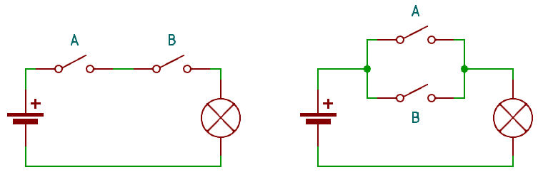
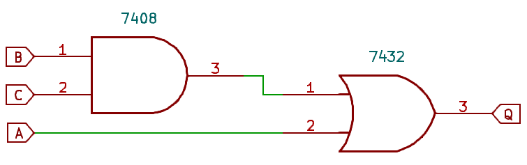

# Logiska grindar: Digitalteknikens byggstenar

I föregående kapitel visades bl.a. hur information representeras binärt via till exempel koder. Nu är det dags att gå vidare till nästa steg: hur vi faktiskt *bearbetar* denna information. I den analoga världen kan en signal ha vilket värde som helst längs en kontinuerlig skala. I den digitala världen arbetar vi istället med två distinkta tillstånd: **logisk 1** (hög spänning) och **logisk 0** (låg spänning).

En logisk grind är den komponent som utför en logisk operation på en eller flera insignaler och producerar en utsignal baserat på dessa.

<!-- ---------------------------------------------------------------------------------------------------- -->
## Från strömbrytare till logik

För att förstå logiska grindar kan man likna dem vid strömbrytare i en elektrisk krets. Tänk dig en enkel seriekoppling enligt den vänstra delen av @fig-switch-lampa. För att lampan ska lysa måste både strömbrytare A och strömbrytare B vara stängda. Om vi definierar 'stängd brytare' som 1 och 'öppen brytare' som 0, ser vi att utsignalen blir 1 endast om båda insignalerna är 1. I den parallellkopplade kretsen till höger i @fig-switch-lampa räcker det däremot att minst en av strömbrytarna är stängd för att lampan ska lysa. Utsignalen blir här 1 så länge minst en av insignalerna är 1. Dessa två enkla kretsar illustrerar grundprinciperna för de logiska funktionerna AND (svenska: OCH) och OR (svenska: ELLER).

{#fig-switch-lampa width=70%}

Detta exempel med switchar och lampa visar fundamenten i digital systemdesign:

* **Ingångar:** Den information vi vill bearbeta.
* **Logisk funktion:** Den "regel" grinden följer (t.ex. "om A och B är sanna...").
* **Utgång:** Resultatet av operationen.

<!-- ---------------------------------------------------------------------------------------------------- -->
## Grinden som abstraktion

När vi ritar digitala system använder vi oss av en **abstraktion**. Vi behöver inte bekymra oss om exakt hur transistorerna inuti en krets fungerar för att kunna designa en maskin – vi fokuserar på den logiska funktionen. Abstraktion sker även successivt på högre nivåer - när vi förstår hur en grind fungerar och kombinerar dem till mer komplexa byggblock kommer vi inte bry oss så mycket om nätet av grindar utan mer fokusera på byggblockets funktioner.

En grind är alltså en "svart låda" med förutsägbara egenskaper. Genom att kombinera dessa enkla grindar kan vi skapa allt från enkla räknare till extremt komplexa processorer. I kommande avsnitt ska vi lära oss hur vi systematiskt beskriver vad som händer inuti dessa "svarta lådor" med hjälp av sanningstabeller.

<!-- ---------------------------------------------------------------------------------------------------- -->
## Sanningstabeller: Ett systematiskt analysverktyg

För att slippa rita kretsscheman varje gång vi vill förstå en funktion använder vi **sanningstabeller**. En sanningstabell är en matematisk tabell som listar alla tänkbara kombinationer av insignaler (A och B) och visar vad den resulterande utsignalen (Q) blir för varje scenario.

Det fina med en sanningstabell är att den är uttömmande. Om vi har $n$ stycken insignaler, kommer tabellen alltid att ha $2^n$ rader. För våra två grundläggande grindar innebär det $2^2 = 4$ möjliga kombinationer. Ibland sker dock förenklingar där flera rader med likartade egenskaper kombineras till en enskild rad.

### Sanningstabell för AND-grinden

AND-funktionen (se vänster kretsschema i @fig-switch-lampa) kräver att **båda** insignalerna är 1 för att utsignalen ska bli 1. Den logiska notationen skrivs ofta som $A \cdot B = Q$. Notationen är ett exempel på Booles algebra, som vi kommer till senare.

Table: Sanningstabell för AND {#tbl-and}

| A | B | Q (AND) |
|---|---|---|
| 0 | 0 | 0 |
| 0 | 1 | 0 |
| 1 | 0 | 0 |
| 1 | 1 | 1 |

### Sanningstabell för OR-grinden{#sec-logiska-grindar}

OR-funktionen (e höger kretsschema i @fig-switch-lampa) kräver att **minst en** av insignalerna är 1 för att utsignalen ska bli 1. Den logiska notationen skrivs ofta som $A + B = Q$.

Table: Sanningstabell för OR {#tbl-or}

| A | B | Q (OR) |
|---|---|---|
| 0 | 0 | 0 |
| 0 | 1 | 1 |
| 1 | 0 | 1 |
| 1 | 1 | 1 |

Att lära sig läsa dessa tabeller är grundbulten i all digital design. När vi senare börjar kombinera grindar för att bygga mer avancerade logiska nätverk, använder vi dessa tabeller för att bevisa att våra kretsar faktiskt utför den logik vi förväntar oss.

::: {.callout-note}
## Exempel: Logik i ett ADAS-system för fordon
För att förstå hur logiska grindar samverkar i praktiken kan vi studera ett förenklat säkerhetssystem i en modern bil. Systemet ska aktivera bromsarna (Q) under tre specifika förhållanden:

1. Föraren bromsar (A)
2. Bilens radar indikerar ett hinder (B)
3. Bilens kamera indikerar ett hinder (C)

Logiken för systemet är att bromsen ska aktiveras om **föraren bromsar** ELLER (om **både radar OCH kamera** indikerar hinder). Matematiskt med Booles algebra kan detta uttryckas som $Q = A + (B \cdot C)$.

Här ser vi hur de olika indata-kombinationerna påverkar bromsaktiveringen. Notera hur de fjärde raden visar hur radarn och kameran tillsammans kan tvinga fram en bromsning även om föraren inte trycker på bromspedalen.

Table: Sanningstabell för ADAS-bromsning {#tbl-adas}

| Förare (A) | Radar (B) | Kamera (C) | Broms (Q) |
|:---:|:---:|:---:|:---:|
| 0 | 0 | 0 | 0 |
| 0 | 0 | 1 | 0 |
| 0 | 1 | 0 | 0 |
| 0 | 1 | 1 | 1 |
| 1 | 0 | 0 | 1 |
| 1 | 0 | 1 | 1 |
| 1 | 1 | 0 | 1 |
| 1 | 1 | 1 | 1 |

Denna tabell tydliggör systemets säkerhetsfilosofi: föraråtgärden prioriteras (rad 5-8), men vi har också en redundant säkerhetskontroll där radarn och kameran måste vara eniga för att aktivera automatisk nödbromsning (rad 4).

:::

<!-- ---------------------------------------------------------------------------------------------------- -->
## Logiska grindar: Symboler och funktion

Inom digitaltekniken används två huvudstandarder för att rita grindar: **IEC** (den rektangulära formen) och **ANSI/IEEE** (den karaktäristiska "bågformen"). Oberoende av vilken standard som används är den logiska funktionen alltid densamma.

 CC BY-SA 3.0, https://commons.wikimedia.org/w/index.php?curid=460661](images/03-logiska-grindar//Logic-gate-index.png){#fig-gate-index width=100%}

Som vi ser i @fig-gate-index representerar varje grind en unik logisk operation. En central princip att notera är **inverteringsbubblan** (den lilla cirkeln vid utgången), som i ett kopplingsschema indikerar en NOT-operation.

Vilka symboler ska man lära sig? Det enkla och jobbiga svaret är både europeisk och amerikansk standard (ANSI/IEEE). Båda varianterna stöter man på i olika sorters dokumentation. I denna bok kommer amerikanska symboler användas, eftersom de finns i datablad för digitaltekniska kretsar.

### Buffer och Inverterare (NOT)

En **Buffer** kopierar insignalen direkt till utgången ($Q = A$). En **NOT-grind** (inverterare) vänder på signalen så att 1 blir 0 och 0 blir 1 (notationn för NOT är ett rakt streck ovanför variabeln, $Q = \overline{A}$).

Table: Sanningstabell för Buffer och NOT {#tbl-buffer-not}

| A | Buffer (Q) | NOT (Q) |
|:---:|:---:|:---:|
| 0 | 0 | 1 |
| 1 | 1 | 0 |

### AND och NAND

**AND-grinden** ger endast 1 om *alla* insignaler är 1. **NAND-grinden** (NOT-AND) är dess raka motsats – den ger 0 endast om alla insignaler är 1.

Table: Sanningstabell för AND och NAND {#tbl-and-nand}

| A | B | AND (Q) | NAND (Q) |
|:---:|:---:|:---:|:---:|
| 0 | 0 | 0 | 1 |
| 0 | 1 | 0 | 1 |
| 1 | 0 | 0 | 1 |
| 1 | 1 | 1 | 0 |

### OR och NOR

**OR-grinden** ger 1 om *minst en* insignal är 1. **NOR-grinden** (NOT-OR) ger 1 endast när båda insignalerna är 0.

Table: Sanningstabell för OR och NOR {#tbl-or-nor}

| A | B | OR (Q) | NOR (Q) |
|:---:|:---:|:---:|:---:|
| 0 | 0 | 0 | 1 |
| 0 | 1 | 1 | 0 |
| 1 | 0 | 1 | 0 |
| 1 | 1 | 1 | 0 |

::: {.callout-tip}
## NOR-grinden och NAND-grinden: De universella byggstenenarna
NOR-grinden är tillsammans med NAND-grinden unika eftersom man genom att kombinera enbart NOR-grindar alternativt bara NAND-grindar kan bygga *alla* andra logiska funktioner. Detta gör dessa grindar viktiga i praktisk chip-design. För den som designar hårdvara med logiska grindar kan det också ha betydelse. IC-kretsar med logiska grindar innehåller generellt flera stycken grindar av samma typ. Det innebär  att man som hårdvarudesigner ofta har grindar över, som kan avnändas för att realisera någon annan form av grind. Ett enkelt exempel är att en NOT-grind enkelt kan byggas med en NOR eller NAND genom att ingångarna kopplas samman. 
:::

### XOR och XNOR

**XOR-grinden** (Exklusivt ELLER) ger 1 när insignalerna är *olika*. **XNOR-grinden** (NOT-XOR) ger 1 när insignalerna är *lika*.

Table: Sanningstabell för XOR och XNOR {#tbl-xor-xnor}

| A | B | XOR (Q) | XNOR (Q) |
|:---:|:---:|:---:|:---:|
| 0 | 0 | 0 | 1 |
| 0 | 1 | 1 | 0 |
| 1 | 0 | 1 | 0 |
| 1 | 1 | 0 | 1 |

Notationen för NOR är $Q = A \oplus B$. XNOR skrivs med hjälp av invertering som $Q = \overline{A \oplus B}$ eller med ett annat tecken $Q = A \odot B$. I denna bok används notationen $Q = \overline{A \oplus B}$.

### När vi har fler än två ingångar

För de flesta grindar (som AND och OR) är utökningen till fler ingångar intuitiv. En AND-grind med exempelvis fyra ingångar ger 1 endast om *alla* fyra är 1. För en OR-grind med med flera ingångar gäller fortfarande att det räcker att en ingång är 1 för att utgången ska bli 1. Men för XOR-grinden kräver definitionen lite extra eftertanke.

::: {.callout-important}
## XOR och XNOR med fler än två ingångar

Det är lätt att tro att en XOR-grind med tre ingångar ger 1 om *exakt en* ingång är 1. Den korrekta definitionen är dock att XOR-grinden fungerar som en **udda-funktion** (**odd parity**):

* Utgången är 1 om ett *udda antal* ingångar är 1.
* Utgången är 0 om ett *jämnt antal* ingångar är 1.

Detta innebär att $A \oplus B \oplus C$ blir 1 om antingen en eller alla tre ingångar är 1.
:::

För XNOR-grinden är logiken den omvända: den fungerar som en **jämn-funktion** (**even parity**) och ger 1 om ett jämnt antal ingångar är 1 (inklusive noll ingångar).

::: {.callout-note}
## Exempel: Analys av 3-ingångars XOR

Table: Sanningstabell för 3-ingångars XOR {#tbl-xor-3-in}

| A | B | C | Q (XOR) |
|:---:|:---:|:---:|:---:|
| 0 | 0 | 0 | 0 |
| 0 | 0 | 1 | 1 |
| 0 | 1 | 0 | 1 |
| 0 | 1 | 1 | 0 |
| 1 | 0 | 0 | 1 |
| 1 | 0 | 1 | 0 |
| 1 | 1 | 0 | 0 |
| 1 | 1 | 1 | 1 |

När vi utökar XOR-grinden till tre ingångar ($A \oplus B \oplus C$) lämnar vi den enkla "en-av-tre"-logiken bakom oss. Istället ser vi att utsignalen $Q$ blir 1 endast när antalet ettor på ingångarna är udda. Som tabellen i @tbl-xor-3-in visar, får vi en hög utsignal ($Q=1$) i följande fall:

* Precis en ingång är 1 (rad 2, 3, 5).
* Alla tre ingångarna är 1 (rad 8).

Detta bekräftar definitionen av XOR som en "udda-funktion". Om vi skulle addera en fjärde ingång ($D$) skulle utsignalen bli 1 igen om totalt antal ettor är udda (1 eller 3 stycken).
:::

### Från teori till hårdvara: 7400-serien

För att bygga digital elektronik för enklare applikationer i verkligheten använder vi integrerade kretsar. Den mest klassiska familjen är **7400-serien**, där kapslar ofta innehåller "Quad"-logik, det vill säga fyra grindar i samma hus. Dessa klassiska kretsar användes förr i stor skala för att bygga upp komplexa digitala lösningar. Idag så byggs mer komplex digitalelektronik primärt med **FPGA** (field-programmable gate array) eller **ASIC** (application-specific integrated circuit), där logiken beskrivs med hårdvarubeskrivande språk som VHDL eller Verilog. Men 7400-serien är fortfarande mycket användbar inom exempelvis embeddedområdet när man behöver skapa enklare digitala funktioner.

Det är dock viktigt att förstå att 7400-serien omfattar massor av olika kretsar, inte bara grindar. Några exempel är:

* **Flip-flops** och **register:** För att lagra binär information.
* **Räknare:** För att skapa klockade sekvenser.
* **Multiplexer:** För att välja mellan olika insignaler.

Table: Klassiska grind-kretsar i 7400-serien {#tbl-7400-gates}

| Krets | Funktion | Antal grindar |
| :--- | :--- | :--- |
| 7400 | NAND-grindar (2-ingångar) | 4 |
| 7402 | NOR-grindar (2-ingångar) | 4 |
| 7404 | Inverterare (NOT) | 6 |
| 7408 | AND-grindar (2-ingångar) | 4 |
| 7432 | OR-grindar (2-ingångar) | 4 |
| 7486 | XOR-grindar (2-ingångar) | 4 |
| 74266 | XNOR-grindar (2-ingångar) | 4 |

::: {.callout-note}
## Exempel: Realisering av ADAS-system

För att realisera vårt exempel med ADAS-system från @sec-logiska-grindar i hårdvara använder vi oss av två olika 14-pinnars kretsar ur 7400-serien. Detta är ett utmärkt exempel på hur vi kombinerar olika "Quad-logik"-kretsar för att skapa en funktionell enhet. ADAS-systemet kunde skrivas som ($Q = A + (B \cdot C)$), dvs. en AND-funktion som kombinerar två ingångar (radar B och kamera C) som går vidare till en OR-funktion som kombinerar AND-grindens utgång med ytterligare en ingång (föraren A).

Komponentval:

* 7408 (Quad 2-input AND): Vi använder en av de fyra grindarna för att kombinera *Radar (B)* och *Kamera (C)*.
* 7432 (Quad 2-input OR): Vi använder en av de fyra grindarna för att summera AND-grindens utgång med *Förarens input (A)*.

Kopplingsbeskrivning: 

1.  *Radar (B)* och *Kamera (C)* ansluts till ingångarna på en grind i 7408-kretsen (t.ex. pin 1 och 2).
2.  Utgången från denna AND-grind (t.ex. pin 3) kopplas till en av ingångarna på en grind i 7432-kretsen (t.ex. pin 1).
3.  *Föraren (A)* kopplas till den andra ingången på samma OR-grind i 7432-kretsen (pin 2).
4.  Utgången på OR-grinden (pin 3 på 7432) ger oss den slutgiltiga *Bromssignalen (Q)*.

{#fig-ADAS width=47%}

Table: Kopplingsöversikt för ADAS-system {#tbl-adas-wiring}

| Signaler | Komponent | Pin (Exempel) |
| :--- | :--- | :--- |
| B & C (Radar/Kamera) | 7408 (AND) | 1, 2 (In) / 3 (Ut) |
| A (Förare) & Utgång 7408 | 7432 (OR) | 1, 2 (In) / 3 (Ut) |
| Bromssignal (Q) | - | 3 (Ut) |

:::

::: {.callout-important}
## Hantering av oanvända grindar
Eftersom 7408 och 7432 i exemplet ovan båda är "Quad"-kretsar har vi tre grindar över i varje kapsel som inte används. Kom ihåg att *oanvända ingångar aldrig får lämnas flytande (oanslutna)*. En flytande ingång fungerar som en antenn för elektriskt brus. Koppla dessa ingångar till antingen jord ($0\text{V}$) eller matningsspänning ($+5\text{V}$) för att undvika att kretsen börjar bete sig konstigt.
:::

