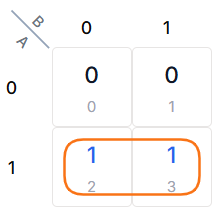
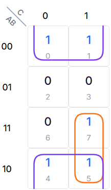
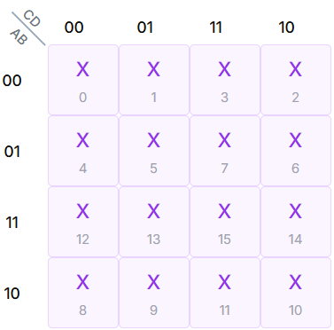
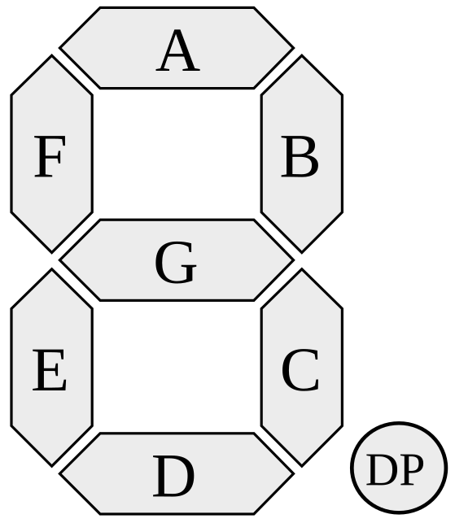
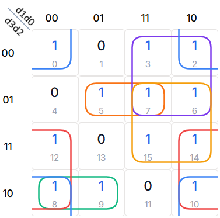
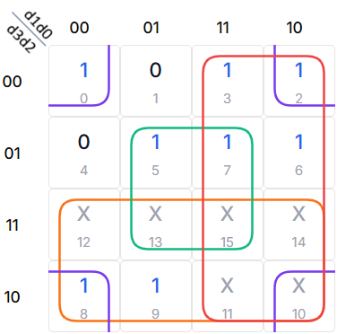
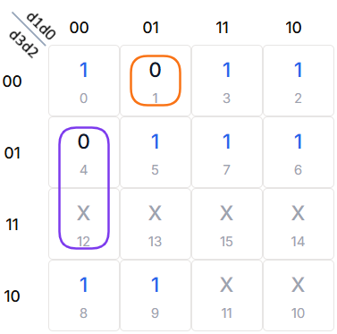

<!-- ---------------------------------------------------------------------------------------------------- -->
<!-- Definition av färger som används i ekvationer kopplade till Karnaughdiagrammens färger               -->
\definecolor{highlight_249_115_022}{rgb}{0.976, 0.451, 0.086}
\definecolor{highlight_124_058_237}{rgb}{0.486, 0.227, 0.929}
\definecolor{highlight_016_185_129}{rgb}{0.063, 0.725, 0.506}
\definecolor{highlight_239_068_068}{rgb}{0.937, 0.267, 0.267}
\definecolor{highlight_059_130_246}{rgb}{0.231, 0.510, 0.965}
\definecolor{highlight_245_158_011}{rgb}{0.961, 0.620, 0.043}
<!-- ---------------------------------------------------------------------------------------------------- -->

# Boolesk algebra – Logikens matematik

<!-- ---------------------------------------------------------------------------------------------------- -->
## Varför räkna på logik?

När vi arbetar med digitalteknik är det lätt att tro att det räcker med "sunt förnuft". Om en lampa ska lysa när två knappar trycks in, drar vi slutsatsen att vi behöver en AND-grind. Men i verkliga system, där dussintals sensorer och signaler samverkar, räcker intuitionen inte till. Här kommer **Boolesk algebra** in i bilden. Det är ett matematiskt system, utvecklat av George Boole på 1800-talet, som låter oss beskriva logiska samband med variabler och operatorer istället för bara ord eller krångliga scheman.

Du kanske frågar dig: *"Varför måste jag lära mig formler när jag kan tänka ut lösningen?"* Svaret är enkelt: *Optimering.* En duktig ingenjör nöjer sig inte med en krets som bara "fungerar". Vi vill bygga kretsar som är:

* *Billigare:* Färre grindar innebär lägre komponentkostnader.
* *Mindre:* Mindre yta på kretskortet ger mer kompakta produkter.
* *Snabbare:* Varje grind signalen passerar skapar en liten fördröjning. Färre steg ger snabbare system.
* *Strömsnåla:* Varje transistor som switchar drar energi.

Genom att använda de Booleska lagarna kan vi ta ett komplext uttryck – som vid första anblick ser ut att kräva fem olika kretsar – och bevisa att det i själva verket kan ersättas av en enda ledare eller en enkel grind. Algebran ger oss ett universellt språk att dokumentera våra lösningar med, så att kollegor kan följa vårt resonemang svart på vitt.

<!-- ---------------------------------------------------------------------------------------------------- -->
## Den logiska syntaxen

För att kunna räkna med logik behöver vi ett gemensamt språk. Inom digitaltekniken använder vi standardiserad notation för att beskriva grindar och deras funktioner i formler. När vi skriver Booleska uttryck använder vi tre huvudoperationer, NOT, AND och OR. Notera att det finns flera olika sätt att skriva samma sak beroende på vilken litteratur man läser:

Table: Logiska operationer och notation. Tabellen visar standardnotation och alternativa sätt att uttrycka Booleska funktioner. Invertering, logisk produkt och logisk summa räknas som **axiom**, vilket kan sägas vara grundantaganden som hålls för sanna och utgör basen för det teoretiska ramverket. {#tbl-booleska_notationer}

| Funktion | Beskrivning | Notation (Standard) | Alternativ notation |
| :--- | :--- | :--- | :--- |
| **NOT** | Invertering | $\overline{A}$ | $A'$ eller $NOT(A)$ |
| **AND** | Logisk produkt | $A \cdot B$ | $AB$ |
| **OR** | Logisk summa | $A + B$ | $A \lor B$ |
| **XOR** | Exklusivt ELLER | $A \oplus B$ | $A \text{ EOR } B$ |
| **NAND** | Inverterad AND | $\overline{A \cdot B}$ | $A \uparrow B$ |
| **NOR** | Inverterad OR | $\overline{A + B}$ | $A \downarrow B$ |
| **XNOR** | Inverterad XOR | $\overline{A \oplus B}$ | $A \odot B$ |

I denna litteratur används standardnotationen.

För att tolka notationen på ett korrekt sätt behövs vissa räkneregler som vi till stor känner igen från den vanliga algebran.

* *Prioritetsordning:* Precis som i vanlig matematik ($1 + 2 \cdot 3$) finns en prioriteringsordning. NOT (invertering) utförs alltid först, följt av AND (multiplikation), och sist OR (addition).
* *Parenteser:* Om du vill styra ordningen, använd parenteser precis som i vanlig algebra. Exempel: $(A + B) \cdot C$ innebär att OR-operationen sker före AND.

::: {.callout-tip}
## Visuell översikt
Det är viktigt att snabbt kunna koppla ihop en matematisk symbol med en fysisk grind. *Kom ihåg:*

* När du ser $A \cdot B$ (AND), tänk på det som *"både A och B måste vara 1"*.
* När du ser $A + B$ (OR), tänk på det som *"antingen A eller B (eller båda) måste vara 1"*.
:::

## Från sanningstabell till uttryck

Innan vi kan börja förenkla måste vi kunna översätta en funktionsbeskrivning till matematik. Vi gör detta genom att titta på en sanningstabell och extrahera de rader där något faktiskt händer. Precis som att binära tal har två symboler, kan detta göras på två olika sätt genom att fokusera på 0 eller 1.

### Mintermer: Fokus på när det händer (1:or) {#sec-mintermer}

Det vanligaste sättet är att skapa en **summa av produkter**. Vi tittar på varje rad i sanningstabellen där utgången $Y = 1$. 

Varje sådan rad bildar en **minterm**, där vi multiplicerar (AND) ihop de insignaler som krävs:

* Om en insignal är $0$ på raden, skriver vi den som inverterad ($\overline{A}$).
* Om en insignal är $1$ på raden, skriver vi den som den är ($A$).

::: {.callout-note}
## Enkel larmkrets
Vi vill att ett larm ($Y$) ska gå om sensor $A$ är aktiverad (1) samtidigt som sensor $B$ är inaktiv (0).

Table: Sanningstabell för enkel larmkrets med två ingångar. {#tbl-tt-alarm}

| A | B | Y | Minterm |
|:---:|:---:|:---:|:---|
| 0 | 0 | 0 | - |
| 0 | 1 | 0 | - |
| 1 | 0 | 1 | $A \cdot \overline{B}$ |
| 1 | 1 | 0 | - |

Detta ger oss det matematiska uttrycket $Y = A \cdot \overline{B}$. Med detta som grund kan vi börja använda logikens lagar för att manipulera och förenkla betydligt mer komplexa system.
:::

::: {.callout-note}
## Exempel: Säkerhetsspärr med tre insignaler

Vi har tre sensorer till en maskin: *Startknapp ($A$)*, *Säkerhetslucka ($B$)* och *Serviceläge ($C$)*. 
Maskinen ska starta ($Y=1$) i två specifika fall. Dels när vanliga operatören kör maskinen och har stängt säkerhetsluckan och tryckt på startknappen. Men den ska också kunna köras av servicetekniker med öppen lucka när startknappen inte är aktiverad. Vi ställer upp sanningstabellen för att identifiera våra mintermer.

Table: Sanningstabell för säkerhetsspärr med tre ingångar. {#tbl-tt-safety-circuit}

| A | B | C | Y | Minterm |
| :---: | :---: | :---: | :---: | :--- |
| 0 | 0 | 0 | 0 | - |
| 0 | 0 | 1 | 1 | $\overline{A} \cdot \overline{B} \cdot C$ |
| 0 | 1 | 0 | 0 | - |
| 0 | 1 | 1 | 0 | - |
| 1 | 0 | 0 | 0 | - |
| 1 | 0 | 1 | 0 | - |
| 1 | 1 | 0 | 1 | $A \cdot B \cdot \overline{C}$ |
| 1 | 1 | 1 | 0 | - |

För att gå från tabell till uttryck identifieras de rader där utgängen är 1. Det blir två produkttermer, $\overline{A} \cdot \overline{B} \cdot C$ | respektive $A \cdot B \cdot \overline{C}$ |. Dessa summeras till ett totalt uttryck (eller kopplas samman i en OR-grind om vi tänker realisering). Vi skapar alltså summan (OR) av de två mintermerna där $Y=1$:
$$Y = (\overline{A} \cdot \overline{B} \cdot C) + (A \cdot B \cdot \overline{C})$$
:::

::: {.callout-tip}
## Så här läser du uttrycket
När du ser uttrycket $Y = (\overline{A} \cdot \overline{B} \cdot C) + (A \cdot B \cdot \overline{C})$ kan du läsa det som:
*"Maskinen startar om (A är 0 OCH B är 0 OCH C är 1) ELLER om (A är 1 OCH B är 1 OCH C är 0)."* Parenteserna hjälper oss att se de två separata logiska vägarna tydligt.
:::

### Maxtermer: Fokus på när det inte händer (0:or)

Ibland är det enklare eller mer effektivt att beskriva när en utgång *inte* ska vara aktiv. Detta gör vi genom att titta på de rader där utgången $Y = 0$. Vi skapar då en **produkt av summor**.

Varje rad där $Y = 0$ bildar en **maxterm**, där vi adderar (OR) insignalerna:
* Om en insignal är $1$ på raden, skriver vi den som inverterad ($\overline{A}$).
* Om en insignal är $0$ på raden, skriver vi den som den är ($A$).

Låt oss använda samma larmkrets som tidigare, men nu extraherar vi de rader där $Y = 0$.

::: {.callout-note}
## Exempel: Maxtermer för larmkretsen

Table: Samma sanningstabell som @tbl-tt-alarm, men med maxtermer i stället för mintermer. {#tbl-tt-alarm-maxterms}

| A | B | Y | Maxterm (A+B) |
|:---:|:---:|:---:|:---:|
| 0 | 0 | 0 | $(A + B)$ |
| 0 | 1 | 0 | $(A + \overline{B})$ |
| 1 | 0 | 1 | - |
| 1 | 1 | 0 | $(\overline{A} + \overline{B})$ |

För att få det färdiga uttrycket multiplicerar (AND) vi ihop dessa maxtermer:
$Y = (A + B) \cdot (A + \overline{B}) \cdot (\overline{A} + \overline{B})$
En notering är att detta ser mycket mer komplicerat ut än när samma exempel bearbetades i @sec-mintermer. Det stämmer mycket riktigt, men man kan välja en av dessa två metoder för att bygga upp sitt booleska uttryck. $Y = (A + B) \cdot (A + \overline{B}) \cdot (\overline{A} + \overline{B})$ är alltså ekvivalent med $A \cdot \overline{B}$.
:::

Vilken metod ska man välja? Detta kan kännas som "tårta på tårta" – varför ha två metoder? Svaret är **minimering** och skapa så enkla förutsättningar som möjligt innan förenkling och optimering sker.

* **Mintermer (Sum of Products):** Används ofta när det finns få rader med 1:or i sanningstabellen.
* **Maxtermer (Product of Sums):** Används ofta när det finns få rader med 0:or i sanningstabellen.

::: {.callout-tip}
## Tips från ingenjören:
I praktiken kommer du oftast att använda mintermer för att ställa upp din första "råa" logik. När du väl har uttrycket på plats använder du Boolesk algebra (som vi går igenom i nästa avsnitt) för att förenkla uttrycket till minsta möjliga antal grindar, oavsett vilken metod du startade med.
:::

<!-- ---------------------------------------------------------------------------------------------------- -->
## Grundläggande Booleska lagar

När vi har översatt ett logiskt problem till ett matematiskt uttryck får vi ofta en lösning som är komplex och kräver onödigt många grindar. För att bygga en effektiv krets använder vi Boolesk algebra för att förenkla uttrycket. Här är de grundläggande verktygen vi använder för att manipulera våra uttryck.

Table: Grundläggande Booleska lagar. Viktiga lagar är **Identitet**, **Noll- och ett-lag**, **Idempotens**, **Invertering** samt **Dubbel negation**.{#tbl-booleska_grundlagar}

| Lag | AND-form | OR-form |
| :--- | :- | :- |
| Identitet | $A \cdot 1 = A$ | $A + 0 = A$ |
| Noll- och ett-lag | $A \cdot 0 = 0$ | $A + 1 = 1$ |
| Idempotens | $A \cdot A = A$ | $A + A = A$ |
| Invertering | $A \cdot \overline{A} = 0$ | $A + \overline{A} = 1$ |
| Dubbel negation | $\overline{\overline{A}} = A$ | - |

Utöver dessa lagar i @tbl-booleska_grundlagar finns de **kommutativa**, **associativa** och **distributiva** lagarna (algebraiska lagar), som fungerar precis som i vanlig matematik (se @tbl-booleska_algebraiska_lagar).

Table: Algebraiska Booleska lagar. {#tbl-booleska_algebraiska_lagar}

| Lag | AND-form | OR-form |
| :--- | :- | :- |
| Kommutativ | $A \cdot B = B \cdot A$ | $A + B = B + A$ |
| Associativ | $A \cdot (B \cdot C) = (A \cdot B) \cdot C$ | $A + (B + C) = (A + B) + C$ |
| Distributiv | $A \cdot (B + C) = A \cdot B + A \cdot C$ | $A + (B \cdot C) = (A + B) \cdot (A + C)$ |

<!-- ---------------------------------------------------------------------------------------------------- -->
## De Morgans lagar

De Morgans lagar är det absolut viktigaste verktyget för att hantera inverterade uttryck när bearbetning av logiska uttryck sker. Gäller särskilt när vi arbetar med NAND- och NOR-logik. De beskriver hur en "NOT"-operation påverkar en AND- respektive OR-grind.

De två lagarna lyder:

* $\overline{A \cdot B} = \overline{A} + \overline{B}$
* $\overline{A + B} = \overline{A} \cdot \overline{B}$

Lagarna är enkla att bevisa genom att ställa upp sanningstabeller för vänster led respektive höger led.

::: {.callout-tip}
## Ingenjörens minnesregel: "Bryt och byt"
När du ska förenkla ett uttryck med ett långt överstreck, följ dessa två steg:

1. *Bryt:* Dela upp det långa överstrecket i flera kortare över varje enskild variabel.
2. *Byt:* Byt ut operationen mellan variablerna – ändra AND ($\cdot$) till OR ($+$), eller OR ($+$) till AND ($\cdot$).
:::

::: {.callout-note}
## Exempel: Bearbetning av uttryck med hjälp av De Morgan
Om vi har uttrycket $\overline{A + \overline{B}}$, så bryter vi överstrecket över $A$ och $\overline{B}$, och byter samtidigt $+$ till $\cdot$:
$\overline{A + \overline{B}} = \overline{A} \cdot \overline{\overline{B}} = \overline{A} \cdot B$
:::

<!-- ---------------------------------------------------------------------------------------------------- -->
## Konsensuslagarna

**Konsensuslagarna** är användbara då man har "överlappande" uttryck och har en redundant term i sitt Booleska uttryck. De kan vara svåra att identifiera i uttryck eftersom de finns i uttryck som ser ut att vara färdigförenklade. De finns i två former:

* $A \cdot B + \overline{A} \cdot C + B \cdot C = A \cdot B + \overline{A} \cdot C$
* $(A + B) \cdot (\overline{A} + C) \cdot (B + C) = (A + B) \cdot (\overline{A} + C)$

Lyckligtvis så kommer en metod presenteras i @sec-Karnaugh-diagram där dessa lagar hanteras per automatik. Då kommer vi introducera Karnaughdiagram, som är en grafisk lösningsmetod för att förenkla logiska uttryck från sanningstabell.

<!-- ---------------------------------------------------------------------------------------------------- -->
## Algebraisk förenkling – en steg-för-steg-metod

Nu när vi har verktygen (de algebraiska lagarna och De Morgan) är det dags att använda dem för att faktiskt bygga billigare och snabbare kretsar. Ett komplext uttryck kräver många grindar, vilket innebär mer värmeutveckling, högre kostnad och längre signalfördröjning.

När du får ett logiskt uttryck, kan det ofta vara bra att följa denna "checklista" för att systematiskt förenkla det:

1. *Expandera:* Använd den distributiva lagen för att lösa upp parenteser.
2. *Identifiera:* Leta efter termer som kan förenklas med speciallagarna (t.ex. $A + \overline{A} = 1$ eller $A \cdot A = A$).
3. *Bryt ut:* Om möjligt, bryt ut gemensamma variabler för att skapa förenklingsbara parenteser.
4. *De Morgan:* Om du har långa överstreck, använd "Bryt och byt" för att förenkla inverteringar.

Numreringen i checklistan ska inte ses som en ordningsföljd som alltid ska följas strikt. Ibland så behöver man till exempel börja med De Morgan innan det går att arbeta vidare med förenkling.

::: {.callout-note}
## Exempel: Förenkling med bryt-ut-metoden

Vi vill förenkla uttrycket: $Y = A \cdot B + A \cdot \overline{B}$

1. *Bryt ut:* Vi ser att $A$ är en gemensam faktor i båda termerna. Vi använder den distributiva lagen baklänges för att bryta ut $A$:
   $Y = A \cdot (B + \overline{B})$

2. *Identifiera:* Vi vet från våra räknelagar (Invertering) att $B + \overline{B} = 1$. Vi byter ut parentesen mot en etta:
   $Y = A \cdot 1$

3. *Slutresultat:* Enligt identitetslagen är $A \cdot 1 = A$.
   $Y = A$

Hårdvarumässigt är detta stor skillnad! Från en krets som ursprungligen krävde två AND-grindar, en inverterare och en OR-grind, har vi nu reducerat det hela till en enkel ledning där utsignalen helt enkelt följer insignalen A.
:::

::: {.callout-note}
## Exempel: Absorptionslagen (Att "äta upp" termer)
Detta är ett av de mest kraftfulla men minst intuitiva sätten att förenkla. Det visar hur en term kan försvinna helt för att den redan är täckt av en annan.

Vi vill förenkla uttrycket: $Y = A + A \cdot B$

1. *Bryt ut:* Vi ser att $A$ finns i båda termerna. Kom ihåg att $A$ är samma sak som $A \cdot 1$:
   $Y = A \cdot 1 + A \cdot B = A \cdot (1 + B)$

2. *Identifiera:* Enligt noll- och ett-lagen är $1 + B = 1$ (allt som OR:as med 1 blir 1):
   $Y = A \cdot 1$

3. *Slutresultat:*
   $Y = A$

Om $A$ redan är sant spelar det ingen roll vad $B$ är. Om $A$ är falskt blir hela uttrycket falskt. Alltså beror utgången enbart på $A$.
:::

::: {.callout-note}
## Exempel: Förenkling av ett uttryck

Vi vill förenkla uttrycket: $Y = A \cdot B + A \cdot (B + C)$

1. *Expandera* (Distributiv lag)  
Vi börjar med att lösa upp parentesen $A \cdot (B + C)$ genom att multiplicera in $A$:  
$Y = A \cdot B + A \cdot B + A \cdot C$

2. *Identifiera*  
Vi ser att $A \cdot B$ förekommer två gånger. Enligt idempotenslagen ($X + X = X$) kan vi slå ihop dessa:  
$Y = A \cdot B + A \cdot C$

3. *Bryt ut* (Distributiv lag)  
Nu ser vi att $A$ är en gemensam faktor i båda termerna. Vi bryter ut $A$:  
$Y = A \cdot (B + C)$

Genom att förenkla $Y = A \cdot B + A \cdot (B + C)$ till $Y = A \cdot (B + C)$, har vi gått från:

* *Ursprungligt:* 2 AND-grindar, 2 OR-grindar.
* *Förenklat:* 1 AND-grind, 1 OR-grind.

Det är en tydlig vinst i fysisk hårdvara!
:::

::: {.callout-note}
## Exempel: Användning av De Morgan
Vi vill förenkla uttrycket: $Y = \overline{A \cdot B} + A$

1. *De Morgan:* Vi börjar med att förenkla den inverterade produkten. Genom att använda "Bryt och byt" ($\overline{A \cdot B} = \overline{A} + \overline{B}$) får vi:
   $Y = \overline{A} + \overline{B} + A$

2. *Kommutativ lag:* Vi flyttar om termerna för att gruppera $A$ och $\overline{A}$ bredvid varandra:
   $Y = (A + \overline{A}) + \overline{B}$

3. *Identifiera:* Vi vet från våra räknelagar (Invertering) att $A + \overline{A} = 1$:
   $Y = 1 + \overline{B}$

4. *Noll- och ett-lag:* Eftersom $1 + \text{något}$ i Boolesk algebra alltid blir 1:
   $Y = 1$

Här ser vi en "alltid-sann"-krets. Oavsett vad $A$ eller $B$ har för värde, kommer utsignalen alltid att vara hög. Det innebär att hela kretsen egentligen bara kan ersättas med en fast anslutning till strömkällan (Logisk 1).
:::

::: {.callout-note}
## Exempel: Ytterligare exempel med De Morgan

Vi vill förenkla uttrycket: $Y = \overline{\overline{A} + B} + A \cdot B$

1. *De Morgan* (på första termen): Vi "bryter och byter" på den stora inverteringen:
   $\overline{\overline{A} + B} = \overline{\overline{A}} \cdot \overline{B}$

2. *Dubbel negation:* Vi vet att $\overline{\overline{A}} = A$, vilket ger oss:
   $A \cdot \overline{B}$

3. *Sätt ihop uttrycket igen:*
   $Y = A \cdot \overline{B} + A \cdot B$

4. *Bryt ut:* Faktorisera ut $A$:
   $Y = A \cdot (\overline{B} + B)$

5. *Identifiera och förenkla:* Eftersom $\overline{B} + B = 1$ enligt inverteringslagen får vi:
   $Y = A \cdot 1 = A$
:::

::: {.callout-note}
## Exempel: Identifiering av redundans (Konsensuslagen)
Ibland kan man bevisa att en term är helt överflödig genom att temporärt "krångla till" uttrycket för att se dolda samband.

Vi vill förenkla uttrycket: $Y = A \cdot B + \overline{A} \cdot C + B \cdot C$

1. *Tricket:* Vi multiplicerar den sista termen ($B \cdot C$) med $(A + \overline{A})$, vilket ju är 1 och inte ändrar värdet:
   $Y = A \cdot B + \overline{A} \cdot C + B \cdot C \cdot (A + \overline{A})$

2. *Expandera:*
   $Y = A \cdot B + \overline{A} \cdot C + A \cdot B \cdot C + \overline{A} \cdot B \cdot C$

3. *Gruppera och bryt ut:* Vi grupperar termer som har gemensamma faktorer:
   $Y = (A \cdot B + A \cdot B \cdot C) + (\overline{A} \cdot C + \overline{A} \cdot B \cdot C)$
   $Y = A \cdot B \cdot (1 + C) + \overline{A} \cdot C \cdot (1 + B)$

4. *Identifiera:* Eftersom $(1+C)=1$ och $(1+B)=1$ enligt noll- och ett-lagen får vi:
   $Y = A \cdot B + \overline{A} \cdot C$

*Slutsats:* Termen $B \cdot C$ var helt onödig! Den kallas för en **konsensusterm** och kan plockas bort utan att kretsens funktion ändras.
:::

::: {.callout-warning}
## Fallgrop: "Överoptimering"
Var försiktig så att du inte förenklar bort logik som behövs för säkerhet eller timing. I skoluppgifter är målet nästan alltid att få så få grindar som möjligt, men i riktiga industrisystem kan redundans ibland vara avsiktlig.
:::

<!-- ---------------------------------------------------------------------------------------------------- -->
## Karnaughdiagram: Logik i två dimensioner {#sec-Karnaugh-diagram}

Hittills har vi förenklat uttryck med hjälp av Boolesk algebra. Det är en elegant metod, men den kräver en hel del "pusselbitar" och risken att missa en förenkling är stor. Här kliver **Karnaughdiagrammet** (ofta förkortat K-diagram eller K-map på engelska) in som en räddare i nöden.

### Historien bakom diagrammet {#sec-karnaugh-history}
Karnaughdiagrammet skapades 1953 av Maurice Karnaugh, en ingenjör vid Bell Labs. På den tiden var digitala datorer gigantiska maskiner fyllda med tusentals vakuumrör. För att bygga pålitliga kretsar var varje grind som kunde elimineras en vinst – både för att minska värmeutvecklingen och för att öka driftsäkerheten. 

Karnaugh insåg att det mänskliga ögat är mycket bättre på att känna igen mönster visuellt än vad vi är på att manipulera långa rader av algebraiska tecken. Han omvandlade därför den logiska algebran till ett tvådimensionellt rutnät.

Ett Karnaughdiagram är i praktiken en sanningstabell som ritats om till en karta. Genom att arrangera tabellen i **Gray-kod** (där varje intilliggande ruta bara skiljer sig med en bit) kan vi direkt "se" vilka termer som kan slås ihop. I Karnaughdiagrammet kan då mönster identifieras. Det går att leta efter block av ettor, vilket kallas **SOP** eller **Sum of Products**. Det motsvarar identifiering av mintermer när man går från sanningstabell till ett Booleskt uttryck. Det går också att leta efter block av nollor, vilket kallas **POS** eller **Product of Sums** (identifiering av maxtermer). Dessa termer kommer förklaras i mer detalj i @sec-SOP-POS.

::: {.callout-note}
## Exempel: Karnaughdiagram med två ingångar
För att förenkla $Y = A \cdot B + A \cdot \overline{B} = A$ kan vi förstås visualisera via sanningstabell och använda Boolesk algebra och komma fram till att det kan förenklas till $Y = A$.

Sanningstabell och mintermer för $Y = A \cdot B + A \cdot \overline{B}$.

Table: Sanningstabell, där mintermer identifieras. {#tbl-tt-example-with-karnaugh}

| A | B | Minterm | Y (utsignal) |
| :---: | :---: | :---: | :---: |
| 0 | 0 | - | 0 |
| 0 | 1 | - | 0 |
| 1 | 0 | $A \cdot \overline{B}$ | 1 |
| 1 | 1 | $A \cdot B$ | 1 |

Men det kan visualiseras i ett Karnaughdiagram istället, där vi helt enkelt in två intilliggande ettor i diagrammet. Om en variabel byter värde inom en grupp (t.ex. går från 0 till 1), så elimineras den automatiskt. Det är som att göra algebraisk förenkling, fast med mönsterigenkänning istället för räkneregler.

{#fig-example-with-karnaugh width=17%}

Genom att visualisera sanningstabellen i ett Karnaughdiagram och identifiera rutor med 1 (SOP, mintermerna) kan man enkelt se att uttrycket blir 1 när $A = 1$, oavsett vad $B$ har för värde. Så istället för att räkna ut att $A \cdot B + A \cdot \overline{B} = A$, ringar vi helt enkelt in två intilliggande ettor i diagrammet för att göra förenklingen direkt.
:::

När vi arbetar med Karnaughdiagram följer vi tre huvudregler:

1. *Storleken spelar roll:* Vi vill skapa så stora grupper som möjligt i multipler av 2 ($1, 2, 4, 8, 16$).
2. *Endast närliggande:* Vi får bara ringa in ettor som ligger vägg-i-vägg (horisontellt eller vertikalt). Vi letar alltså efter rektangulärt formade inringningar.
3. *Inga diagonaler:* Grupper får aldrig bildas diagonalt. Notera! XOR och XNOR syns som diagonala "schackrutemönster" i ett Karnaughdiagram. Karnaughdiagram används alltså för att hitta OR- och AND-strukturer.

::: {.callout-tip}
## Kom ihåg!
Karnaughdiagrammet är inte "platt" – det är en yta som hänger ihop. Den vänstra kanten gränsar mot den högra, och den översta raden gränsar mot den nedersta. Tänk dig att diagrammet är en torus (en badring) eller en cylinder!
:::

Exemplet ovan har bara två variabler $A$ och $B$, så vinsten med att använda Karnaughdiagram jämfört med sanningstabellen är inte uppenbar. Fördelarna blir mer tydliga när vi går till tre eller fler variaabler, vilket beskrivs i de kommande avsnitten.

### Karnaughdiagram för tre variabler

När vi går från två till tre variabler ($A, B, C$) expanderar vi vår sanningstabell från 4 till 8 rader. För att kunna förenkla dessa uttryck visuellt behöver vi ett 3-variablers Karnaughdiagram. Eftersom Karnaughdiagrammet bara har två variabler kommer två av variablerna slås samman. Det spelar egentligen ingen roll hur och i denna bok slår vi samman de två första variablerna och skapar fyra rader i Karnaughdiagrammet. Det viktigaste att komma ihåg här är att vi måste bibehålla Gray-kod i den axel där vi har två variabler. Så i ett 3-variablers diagram lägger vi $AB$ på raderna och $C$ på kolumnerna, se @fig-Karnaugh-3inputs (men man kan lika gärna lägga $A$ på raderna och $BC$ på kolumnerna). Lägg märke till radordningen: *00, 01, 11, 10*.

{#fig-Karnaugh-3inputs width=17%}

Varför används Gray-kod och en ordning där 11 kommer före före 10? Om vi hade skrivit 00, 01, 10, 11 så skulle hoppet mellan 01 och 10 kräva att *två bitar ändras samtidigt*. I ett Karnaughdiagram får varje steg bara innebära att *en enda bit ändras*. Genom att använda Gray-koden (00 -> 01 -> 11 -> 10) garanterar vi att vi alltid kan se grannskapen korrekt.

Eftersom vi använder Gray-kod hänger även kolumnerna ihop. Den första kolumnen (00) och den sista kolumnen (10) betraktas som grannar. Om du har ettor i båda dessa kan de bilda en grupp tillsammans, trots att de ser ut att stå på varsin sida om diagrammet.

::: {.callout-note}
## Exempel: Karnaughdiagram med tre ingångar

{#fig-Karnaugh-example-with-3inputs width=17%}

Ovanstående Karnaughdiagram i @fig-Karnaugh-example-with-3inputs visar ett system med tre ingångar. Fem olika logiska kombinationer ger logisk 1 på utgången. Övriga tre kombinationen ger logisk 0.

Med sanningstabell skulle vi få ett ganska långt uttryck med mintermar:

$$Y = \overline{A}\overline{B}\overline{C} + \overline{A}\overline{B}C + A\overline{B}\overline{C} + A\overline{B}C + ABC$$

Att förenkla från detta uttryck tar lite tid, så istället är det mer effektivt att använda Karnaughdiagrammet. I detta fall så används SOP, det vill säga identifiering av ettor.

I diagrammet ser vi att vi kan ringa in ett block med fyra ettor (violett) som "går runt kanten" och kopplar samman översta och understa raderna. Genom att studera denna inringen kan man se att detta block är 1 när $B = 0$ och att det inte spelar någon roll vad $A$ respektive $C$ har för värde. Detta block kan alltså skrivas som $overline{B}. Sedan finns det en etta kvar (i rutan med ordningstalet 7). Denna kan slås samman med ettan som är i rutan med ordningstalet 5, för att skapa så stor inringning som möjligt (orange). Spelar ingen roll att denna etta redan är med i violetta inringningen. I arbetet med Karnaughdiagrammet strävar man alltid efter så stora inringningar som möjligt. Inringningen med orange färg är 1 när $C = 1$ och när $A = 1$, så den kan representeras som $A \cdot C$.

Kombineras uttrycken för violett inringning och orange inringning fås det förenklade uttrycket:

$$Y = \overline{B} + A \cdot C$$
:::

### Karnaughdiagram för fyra variabler {#sec-karnaugh-4inputs}

När vi går från tre till fyra variabler (till exempel $A, B, C, D$) dubblas antalet möjliga tillstånd från 8 till 16. Att förenkla dessa uttryck algebraiskt blir snabbt arbetssamt, men med ett 4-variablers Karnaughdiagram förblir metoden visuell och intuitiv. Ett 4-variablersdiagram organiseras som en $4 \times 4$-matris, se @fig-Karnaugh-example-4inputs. Viktigt att komma ihåg är att är att använda Gray-kod för båda axlarna ($00, 01, 11, 10$). Detta säkerställer att endast en variabel ändras mellan intilliggande rutor, vilket är en förutsättning för att mönsterigenkänningen ska fungera. 

{#fig-Karnaugh-example-4inputs width=30%}

Med fyra variabler kan vi gruppera ettor i större formationer än tidigare:

* *Grupp om 8:* Eliminerar tre variabler (lämnar en variabel kvar).
* *Grupp om 4:* Eliminerar två variabler (lämnar två variabler kvar).
* *Grupp om 2:* Eliminerar en variabel (lämnar tre variabler kvar).

::: {.callout-note}
## Exempel: Karnaughdiagram för sjusegmentsavkodare, segment $A$

{#fig-7seg-display width=12%}

En sjusegmentsdisplay används ofta för att skapa billig och enkelt display för att visa siffror 0-9. Men den kan även användas för hexadecimala tal, men med justeringen att man skriver b respektive d för att inte blanda samman de hexadecimala tecknen B och D med 8 respektive 0.

En sanningstabell för segment $A$ ser ut som i @tbl-hex-to-7seg. Här representerar ingångarna $d3, d2, d1, d0$ de fyra bitarna i det hexadecimala värdet (0–F). Segment $A$ är utgång.

Table: Sanningstabell för sjusegmentavkodning av segment $A$ för hexadecimala symboler. {#tbl-hex-to-7seg}

| Hexsymbol | $d3$ | $d2$ | $d1$ | $d0$ | Segment $A$ |
| :---: | :---: | :---: | :---: | :---: | :---: |
| 0 | 0 | 0 | 0 | 0 | 1 |
| 1 | 0 | 0 | 0 | 1 | 0 |
| 2 | 0 | 0 | 1 | 0 | 1 |
| 3 | 0 | 0 | 1 | 1 | 1 |
| 4 | 0 | 1 | 0 | 0 | 0 |
| 5 | 0 | 1 | 0 | 1 | 1 |
| 6 | 0 | 1 | 1 | 0 | 1 |
| 7 | 0 | 1 | 1 | 1 | 1 |
| 8 | 1 | 0 | 0 | 0 | 1 |
| 9 | 1 | 0 | 0 | 1 | 1 |
| A | 1 | 0 | 1 | 0 | 1 |
| b | 1 | 0 | 1 | 1 | 0 |
| C | 1 | 1 | 0 | 0 | 1 |
| d | 1 | 1 | 0 | 1 | 0 |
| E | 1 | 1 | 1 | 0 | 1 |
| F | 1 | 1 | 1 | 1 | 1 |

Karnaughdiagrammet med fyra insignaler visas i @fig-Karnaugh-example-4inputs).

{#fig-hex-to-7seg width=30%}

Diagrammet ser lite stökigt ut, men genom att följa färgmarkeringen så ser vi att det finns inringat fyra områden med fyra ettor och två områden med två ettor. Notera att två av områdena med fyra ettor "går över kanten", blå respektive röd. De totalt sex inringade områden kan skrivas som (sambanden följer färgmarkeringen i Karnaughduagrammet):

* $\color{highlight_249_115_022} \overline{d3} \cdot d2 \cdot d0$
* $\color{highlight_124_058_237} \overline{d3} \cdot d1$
* $\color{highlight_016_185_129} d3 \cdot \overline{d2} \cdot \overline{d1}$
* $\color{highlight_239_068_068} d3 \cdot \overline{d0}$
* $\color{highlight_059_130_246} \overline{d2} \cdot \overline{d0}$
* $\color{highlight_245_158_011} d2 \cdot d1$

Hur läser man ut detta? Se till exempel den gröna inringningen. Där ska vi ha $d3 = 1, d2 = 0, d1 = 0$ för att få ettorna inom inringningen. Sista insignalen $d0$ spelar ingen roll. Det utläses då som $d3 \cdot \overline{d2} \cdot \overline{d1}$. Totala uttrycket för $A$-segmentet blir förstås:

$$A = \color{highlight_249_115_022} \overline{d3} \cdot d2 \cdot d0 + \color{highlight_124_058_237} \overline{d3} \cdot d1 + \color{highlight_016_185_129} d3 \cdot \overline{d2} \cdot \overline{d1} + \color{highlight_239_068_068} d3 \cdot \overline{d0} + \color{highlight_059_130_246} \overline{d2} \cdot \overline{d0} + \color{highlight_245_158_011} d2 \cdot d1$$
:::

De övriga sex segmenten? De behöver behandlas i var sitt Karnaughdiagram med de fyra ingångarna $q0$-$q3$. Det krävs alltså sju stycken Karnaughdiagram för att skapa logiken till en sjusegmentsavkodare.

### "Don't care"-villkor (X) {#sec-dont-care}

I många digitala system finns det kombinationer av insignaler som aldrig kommer att inträffa under normal drift. När vi konstruerar en logisk krets för dessa fall spelar det ingen roll om utgången blir logisk 0 eller 1 – kretsen kommer ändå aldrig att hamna i det tillståndet.

Dessa tillstånd kallas för **"don't care"-villkor** och markeras i sanningstabeller och Karnaughdiagram med ett $X$ (eller ett streck).

Det stora pedagogiska och tekniska värdet med "don't care"-villkor är att de ger oss *frihet*. När vi ska minimera en logisk funktion med hjälp av ett Karnaughdiagram får vi välja att låta varje $X$ representera antingen en 0:a eller en 1:a, beroende på vad som ger den största och mest effektiva inringningen.

* Om ett $X$ kan hjälpa oss att skapa en större grupp (t.ex. att inkludera det i ett block om fyra istället för ett block om två), behandlar vi det som en *1:a*.
* Om ett $X$ inte bidrar till att förenkla någon inringning, behandlar vi det som en *0:a* och ignorerar det.

::: {.callout-note}
## Exempel: Karnaughdiagram för sjusegmentsavkodare för BCD, segment $A$
I exempelt med sjusegmentsavkodare i för hexadecimala tecken i @sec-karnaugh-4inputs så var Karnaughdiagrammet fyllt med 0 eller 1. Det behövdes eftersom vi skulle skapa logiken för alla 16 varianter av insignaler. Då kunde vi inte ha någon "don't care". Men för en sjusegmentavkodare för BCD och siffrorna 0-9 blir det annorlunda, då A-F inte ska användas och aldrig kommer förekomma som insignal.

{#fig-BCD-to-7seg width=30%}

Nu kan X väljas som 1 eller 0, beroende på vilket som passar bäst. Då kan ofta större områden ringas in och även färre områden. Här så används alla X som ettor eftersom det ger bäst resultat (stora och få inringningar). I detta exempel så har vi nu två områden med åtta ettor samt två områden med fyra ettor, vilket är betydligt enklare än i exemplet med full hexadecimal avkodning. Det totala uttrycket blir nu:

$$A = \color{highlight_249_115_022} d3 + \color{highlight_124_058_237} \overline{d2} \cdot \overline{d0} + \color{highlight_016_185_129} d2 \cdot d0 + \color{highlight_239_068_068} d1$$

Uttrycket är nu betydligt enklare än motsvarande uttryck för full hexadecimal avkodning. Hårdvaruimplementationen blir naturligtvis också mycket enklare. Detta är styrkan med "don't care", de ger större frihet i designen. Det gäller dock att komma ihåg att om man lägger något annat än BCD-kod (det vill säga man matar in A-F) så kommer avkodningen inte stämma.
:::

::: {.callout-tip}
## Behöver alla X hanteras?
*Viktigt att komma ihåg:* Du behöver inte ringa in alla "don't care"-X. Ring bara in de som faktiskt hjälper dig att göra dina inringningar större.
:::

### Karnaughdiagram för fler än fyra variabler
Kan man ha fler än fyra variabler? Ja i princip, men då går Karnaughdiagrammet från en tvådimensionell struktur som kan visas på skärm eller papper till en flerdimensionell struktur. Med fem respektive sex ingångar blir det som en tredimensionell struktur, dvs. som en kub. Det går dock att skära upp kuben i skivor och lägga ut som flera tvådimensionella diagram, men då behöver man tänka till lite extra för att kunna ringa in ettorna alternativt nollorna. Detta kräver att man är mycket noggrann vid inringningen, eftersom man måste ta hänsyn till grannskap både inom den egna skivan och mellan de två skivorna.

Lyckligtvis finns det onlineverktyg som hjälper till med detta. https://karnaughmapsolver.com/ som använts för att skapa diagrammen i denna litteratur har i skrivande stund stöd för upp till fem ingångar. Andra verktyg har ännu fler möjligheter.

## SOP och POS: Två sätt att uttrycka logik {#sec-SOP-POS}

Tidigare (i @sec-karnaugh-history) introducerades begreppen Sum of Product (SOP) respektive POS (Product of Sums) som två olika sätt att behandla Karnaughdiagrma. Se exempelvis @fig-BCD-to-7seg. Förenklat innebär det att räkna ettor respektive nollor. När vi ska implementera en logisk funktion i en krets kan vi som diskuterats tidigare uttrycka den på två huvudsakliga standardformer, med mintermer (motsvaras av SOP) eller maxtermer (motsvaras av POS). Valet mellan dessa beror ofta på hur många "1:or" jämfört med "0:or" vi har i vår sanningstabell.

### SOP (Sum of Products) – Summan av produkter
SOP är den vanligaste formen när vi arbetar med Karnaughdiagram och det är den som beskrivits hittills. Den innebär att vi identifierar alla kombinationer som ger utgången *logisk 1*.

* *Logik:* "Vi tar AND-kombinationer (produkter) av variabler och OR:ar ihop dem (summerar dem)."
* *Användning:* SOP är intuitivt när vi vill veta *när* en funktion ska aktiveras.
* *Notation:* Strukturen för en SOP-form för en funktion $Y$ ser ut som:
  $$Y = (A \cdot B) + (C \cdot D)$$

### POS (Product of Sums) – Produkten av summor
POS är den "omvända" formen. Här fokuserar vi istället på när utgången ska vara *logisk 0*. Vi identifierar dessa rader i sanningstabellen, skapar OR-villkor (summor) för dem, och AND:ar ihop dessa grupper.

* *Logik:* "Vi skapar OR-kombinationer av variabler och AND:ar ihop dem."
* *Användning:* POS är ofta mer effektivt om funktionen har väldigt få 0:or jämfört med 1:or i sanningstabellen.
* *Notation:* Strukturen för en POS-form för en funktion $Y$ ser ut som:
  $$Y = (A + B) \cdot (C + D)$$

::: {.callout-note}
## Exempel: Karnaughdiagram för sjusegmentsavkodare för BCD, segment $A$, Product of Sums (POS)

Vi återanvänder exempelt med sjusegmentsavkodare och segment $A$ en gång till. I @sec-dont-care studerade vi hur man kan hitta logiska uttrycket för en BCD-till-sjusegmentsavkodare med hjälp av "don't care". I det Karnaughdiagrammet var det få nollor, bara två stycken. Skulle det passa bättre att leta nollor och ringa in dessa?

{#fig-Karnaugh-BCD-to-7seg-POS width=30%}

Precis som innan kan X väljas som 1 eller 0, beroende på vilket som passar bäst. Då kan ofta större områden ringas in och även färre områden. Här ser vi att det bara blir två områden och i det ena (violett inringning) vinner vi på att låta X betyda logisk 0, eftersom vi får ett en större inringning. Inringningen i orange kan nu skrivas som $\color{highlight_249_115_022} (d3 + d2 + d1 + \overline{d0})$. d0 är invers eftersom den är logisk 1 när vi har en utgång som ska vara logisk 0. Inringningen i violett skrivs som $\color{highlight_124_058_237} (\overline{d2} + d1 + d0)$. Här spelar det ingen roll vad d3 har för värde så den utelämnas i uttrycket.

Det totala uttrycket skrivs som produkten av dessa två uttryck:

$$A = \color{highlight_249_115_022} (d3 + d2 + d1 + \overline{d0}) \color{black}{\cdot} \color{highlight_124_058_237} (\overline{d2} + d1 + d0)$$
:::

Är de två olika varianterna ekvivalenta och bara två olika sätt att skriva samma sak? Kan man använda Boolesk algebra för att gå från SOP till POS och vice versa? I detta fallet så är det inte så, vilket beror på att vi använt "don't care". Studerar vi detaljerna i Karnaughdiagrammen i respektive exempel ser vi att position 11 i ena fallet är logisk 1 och i andra fallet logisk 0. Då är de härledda, förenklade uttrycken inte helt ekvivalenta.Men så länge vi håller oss till bara BCD-kodade insignaler ser vi ingen skillnad.

::: {.callout-tip}
## Vilken metod ska man välja?
Valet mellan SOP och POS styrs oftast av antalet inringningar som krävs i ett Karnaughdiagram:

1.  *Ringa in 1:or (SOP):* Om funktionen har få 1:or i sanningstabellen är SOP enklast. Det ger direkt stöd för AND-OR-implementation.
2.  *Ringa in 0:or (POS):* Om funktionen har få 0:or är det snabbare att ringa in dessa (vilket ger uttrycket $\overline{Y}$) och sedan använda de Morgans lagar för att invertera resultatet till POS-form.

*Tänk på:* En krets implementerad i POS-form med NAND-grindar eller NOR-grindar kan ofta bli mer kompakt än en ren AND-OR-implementation, vilket är en viktig faktor vid design av integrerade kretsar.
:::

<!-- ---------------------------------------------------------------------------------------------------- -->
## Från logiska uttryck till grindar: NAND och NOR

I praktiken bygger vi sällan kretsar med en blandning av AND- och OR-grindar. Istället använder vi nästan uteslutande **NAND-logik** eller **NOR-logik**. Varför? För att dessa grindar är "universella" och ofta är både billigare och snabbare att tillverka i kisel i integrerade kretsar. Det är användbart för man kan nämligen skapa alla logiska kretsar med uteslutande NAND, alternativt uteslutande NOR.

I klassiska kretsar i 7400-serien, var NAND en krets som var enkel att implementera direkt i kisel med BJT-transistor. NAND var då en grundkrets i själva kiselstrukturen. För att till exempel få en AND behövdes extra transistor och resistor för att skapa en invertering. Därmed behövdes mer plats på kiselchipet och det gav också ökade förluster. I modernare halvledare, som använder MOS-transistorer är NAND och NOR enklast att implementera, jämfört med andra AND och OR. Därför finns det goda skäl att tala OM NAND-logik och NOR-logik. 

### NAND-logik (för SOP/mintermer)
När vi har tagit fram ett uttryck i SOP-form (Sum of Products) har vi en logisk struktur som ser ut som $Y = (A \cdot B) + (C \cdot D)$. Vi har en summa av produkter. Genom att använda de Morgans lagar kan vi visa att en AND-grind följt av en OR-grind är logiskt ekvivalent med en struktur av endast NAND-grindar, se @fig-NAND-logic. För att implementera en SOP-funktion med NAND så genomförs alltså följande steg:

* Ersätt alla AND-grindar med NAND.
* Ersätt OR-grinden i nästa led med en OR där ingångarna är inverterade för att kompensera för inverteringen som övergången från AND till NAND skapade.
* Ersätt OR-grinden med inverterade ingångar med en NAND (De Morgan). Resultatet blir en krets med enhetlig grindtyp (NAND).

![Omvandling av generellt SOP-struktur med AND-logik för ingångarna som summeras med OR för att få utgången. (1) visar grundlogiken för SOP, $Y = (A \cdot B) + (C \cdot D)$. I (2) ersätts AND med NAND och då måste ingångarna till OR-grinden inverteras på grund av att en invertering införts. Denna OR-grind med inverterade ingångar kan med De Morgans lag skrivas som en NAND, eftersom $Y = \overline{A \cdot B} = \overline{A} + \overline{B}$. Slutligen är vi framme vid schemat i (3) och där har hela logiska kretsen byggts med tre stycken NAND.](images/04-boolesk-algebra/NAND_logic.png){#fig-NAND-logic}

### NOR-logik (för POS/Maxtermer)
När vi arbetar med POS-form (Product of Sums), $Y = (A + B) \cdot (C + D)$, är NOR-grindar vårt främsta verktyg, se @fig-NOR-logic. För att implementera en POS-funktion med NOR så genomförs alltså följande steg:

* Ersätt alla OR-grindar med NOR.
* Ersätt AND-grinden med en AND där ingångarna är inverterade för att kompensera för inverteringen som infördes i föregående steg.
* Ersätt AND-grinden med inverterade ingångar med en NOR (De Morgan). Resultatet blir en krets med enhetlig grindtyp (NOR).

{#fig-NOR-logic}

### Sammanfattning: SOP och POS, mintermer och maxtermer, NAND-logik och NOR-logik
För att knyta ihop hela det Booleska kapitlet kan vi se det som två sidor av samma mynt, se @tbl-NAND_NOR_summary.

Table: Sammanställning NAND- och NOR-logik samt deras koppling till min/max och SOP/POS. {#tbl-NAND_NOR_summary}

| Egenskap | SOP (Mintermer) | POS (Maxtermer) |
| :--- | :--- | :--- |
| Fokus | Identifiera 1:or | Identifiera 0:or |
| Grindtyp | AND-OR | OR-AND |
| Favoritgrind | NAND | NOR |
| Bäst när... | Funktionen har få 1:or | Funktionen har få 0:or |

Att behärska övergången mellan dessa former och förstå hur man "NAND-ifierar" eller "NOR-ifierar" sin krets är det som skiljer en teoretisk logiker från en praktisk hårdvarukonstruktör. Nu när vi har de logiska grunderna på plats, är vi redo att använda dem för att bygga mer avancerade komponenter som multiplexrar och räknare.
