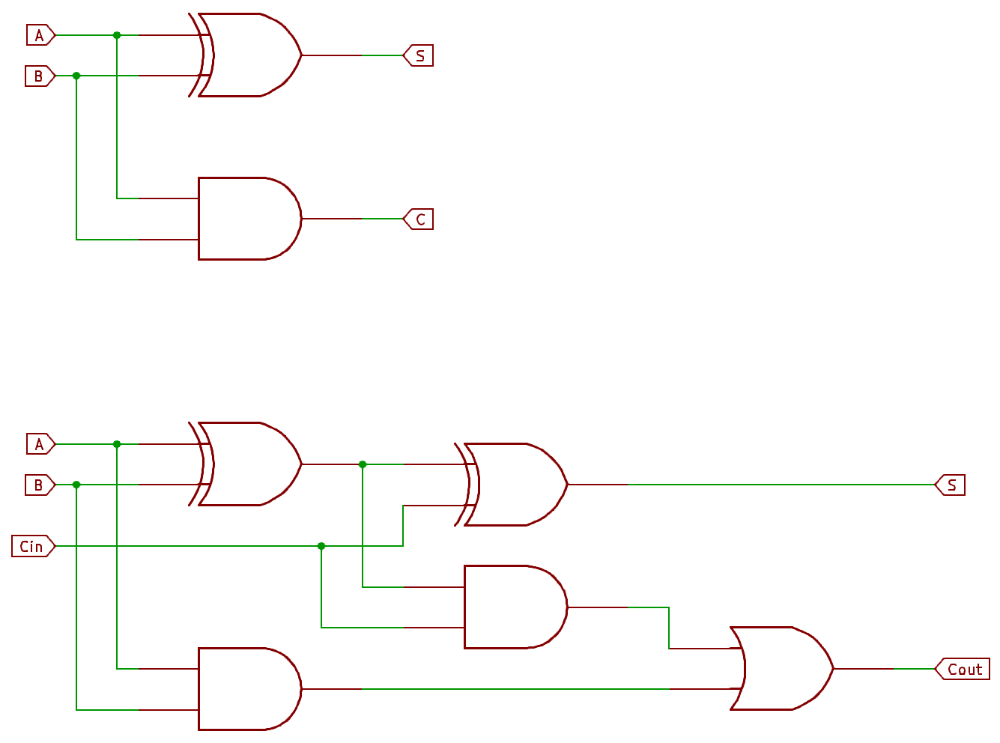
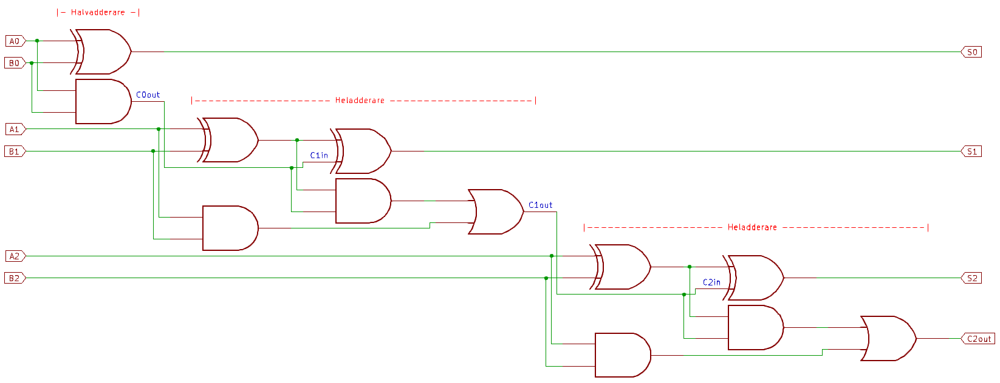

# Kombinatoriska kretsar {#sec-kombinatoriska-kretsar}

I de tidigare kapitlen har vi bekantat oss med de minsta beståndsdelarna i digital logik: de enskilda grindarna. Vi har också lärt oss hur vi med Boolesk algebra och Karnaughdiagram kan optimera dessa för att lösa specifika logiska problem. Nu är det dags att ta steget från lösa komponenter till färdiga **kombinatoriska byggblock**.

<!-- ---------------------------------------------------------------------------------------------------- -->
## Vad är en kombinatorisk krets? {#sec-vad-ar-kombinatoriska-kretsar}

En kombinatorisk krets kännetecknas av att dess utgångar ($Y$) vid varje givet tillfälle **enbart** beror på de nuvarande värdena på ingångarna ($A, B, C \dots$). Man kan likna det vid en matematisk funktion $y = f(x)$; så fort du ändrar $x$, ändras $y$ omedelbart (bortsett från viss fördröjning i hårdvaran).

Det innebär att en kombinatorisk krets:

* **Saknar minne:** Den har ingen aning om vad ingångarna var för en sekund sedan.
* **Är tidsoberoende:** Den bryr sig inte om i vilken ordning signaler anländer, så länge de nuvarande nivåerna är stabila.

För att förstå kraften i kombinatorisk logik underlättar det att se vad den *inte* är. Den andra stora huvudgruppen inom digitalteknik är **sekventiella kretsar** (som vi behandlar i senare kapitel). I en sekventiell krets sparas information, vilket gör att utgången beror både på vad som skickas in just nu och vad som hände tidigare.

Table: Skillnader i egenskaperna hos kombinatoriska kretsar jämfört med sekventiella kretsar. {#tbl-kombinatoriska_sekventiella}

| Egenskap | Kombinatoriska kretsar | Sekventiella kretsar |
| :--- | :--- | :--- |
| **Beroende** | Beror endast på nuvarande ingångar. | Beror på nuvarande ingångar **och** tidigare tillstånd. |
| **Minne** | Nej. | Ja (t.ex. vippor). |
| **Klocka** | Oftast inte (asynkrona). | Oftast klockstyrda (synkrona). |
| **Exempel** | Adderare, Multiplexrar, Avkodare. | Räknare, Register, CPU-styrenheter. |

Kombinatoriska kretsar fungerar alltså som digitalteknikens "beslutsfattare". De tar emot ett gäng bitar och spottar direkt ut ett resultat baserat på en förbestämd logisk struktur. I detta kapitel ska vi titta på de vanligaste av dessa strukturer: från kretsar som kan räkna (adderare) till kretsar som kan välja och dirigera data (multiplexrar).

<!-- ---------------------------------------------------------------------------------------------------- -->
## Logiska nivåer: Active High och Active Low {#sec-active-high-low}

Innan vi går in på specifika komponenter måste vi reda ut ett begrepp som ofta förvirrar nya inom digitalteknik: **Active Low**. 

I teorin tänker vi oss ofta att en "1" betyder PÅ och en "0" betyder AV. Detta kallas för **Active High** (positiv logik). Men i praktiken, särskilt när vi arbetar med komponenter i 7400-serien, är det precis lika vanligt att en funktion aktiveras av en nolla.

### Vad innebär Active Low? {#sec-active-low}
En signal som är **Active Low** (negativ logik) anses vara "sann" eller "aktiv" när spänningen är låg (0 V). När spänningen är hög (5 V alternativt 3.3 V) är funktionen inaktiv.

* **Active High:** 0 = Inaktiv, 1 = Aktiv.
* **Active Low:** 1 = Inaktiv, 0 = Aktiv.

### Hur identifierar man Active Low?  {#sec-hur-identifiera-active-low}
I teknisk dokumentation och kopplingsscheman kan du känna igen Active Low på två tydliga sätt:

1.  **Cirkeln (Inverteringsbubblan):** Om du ser en liten ring vid en ingång eller utgång på en logiksymbol betyder det att signalen inverteras där. En ring på en *Enable*-ingång betyder alltså att kretsen startar när den får en nolla. I äldre datablad kan man ibland se en triangel i stället för en ring.
2.  **Namngivningen:** Signaler som är Active Low skrivs ofta med ett streck över namnet ($\overline{Reset}$), ett prefix (nReset) eller ett suffix (Reset_L eller Reset#).

### Varför krångla till det?  {#sec-varfor-active-low}
Det finns flera tekniska anledningar till att Active Low är industristandard:

* **Robusthet:** Det är ofta enklare och säkrare att dra en signal till jord (GND) för att aktivera något.
* **Elektrisk strömstyrka:** Äldre digitalteknikkretsar (TTL) var konstruerad så att kretsarna var mycket bättre på att "sänka" ström (**sink**, ta emot ström till jord) än att "skicka ut" ström (**source**). Det kan ha betydelse om något ska drivas av digitalkretsen.
* **Wired-OR:** Det underlättar när flera olika kretsar ska kunna dra i samma "nödbroms" (t.ex. en gemensam Reset-lina) utan att kortsluta varandra. Genom att använda Active Low och Open Collector-utgångar kan flera enheter dela på samma ledning.

::: {.callout-important}
### Tips när du kopplar på breadboard eller felsöker din kretskortsdesign
Kontrollera om komponenten du har problem med använder Active Low. Att missa detta är ett av de vanligaste felen vid koppling av digitala kretsar!
:::

<!-- ---------------------------------------------------------------------------------------------------- -->
## Enable: Kretsens huvudströmbrytare {#sec-enable}

Många kretsar i 7400-serien har en eller flera ingångar som kallas för **Enable** (förkortat **EN**, **E** eller ibland **G** för *Gate*). Detta fungerar som en logisk strömbrytare för hela komponenten.

### Varför behövs Enable?
I ett digitalt system delar ofta många olika kretsar på samma ledningar (en så kallad *buss*). Om alla kretsar skulle skicka ut data samtidigt skulle det uppstå kortslutningar eller datakonflikter. 

Enable-pinnen tillåter oss att:

1. **Välja komponent:** Vi kan ha tio olika avkodare i ett system men låta bara en av dem vara "vaken" åt gången.
2. **Spara energi:** I vissa teknologier drar kretsen mindre ström när den är inaktiverad.
3. **Synkronisera:** Vi kan ställa in alla ingångar i lugn och ro och sedan "slå på" kretsen precis när vi vill att resultatet ska visas.

* **När Enable är aktiv:** Kretsen fungerar normalt och följer sin sanningstabell.
* **När Enable är inaktiv:** Kretsen ignoreras. Utgångarna går oftast till ett fast inaktivt läge (eller blir "flytande" i högimpedans-läge).

### Identifiera Enable i scheman
Precis som med logiska nivåer i @sec-varfor-active-low, är Enable-signaler väldigt ofta **Active Low**. 

* **Active High ($EN$ / $G$):** Kretsen aktiveras av en logisk **1:a** (5V).
* **Active Low ($\overline{E}$ / $\overline{G}$):** Kretsen aktiveras av en logisk **0:a** (0V/GND). Denna känns igen på ringen vid ingången eller strecket över namnet.

### Sammansatt Enable
Vissa kretsar kräver att flera villkor är uppfyllda samtidigt för att starta. Ett klassiskt exempel är 3-till-8-avkodaren **74LS138**. Den har tre Enable-pinnar:

* **G1** (Active High)
* **$\overline{G2A}$** (Active Low)
* **$\overline{G2B}$** (Active Low)

För att kretsen ska fungera måste G1 vara hög **SAMTIDIGT** som både $\overline{G2A}$ och $\overline{G2B}$ är låga. Detta är mycket användbart när man vill bygga ut systemet (kaskadkoppla) utan att behöva lägga till extra logikgrindar.

::: {.callout-important}
### Tips från labbet: "Död" krets?
Om du har kopplat in- och utgångar rätt men din krets inte ger något utslag på utgångarna, är det nästan alltid Enable-pinnen som spökar. Kom ihåg att en Active Low Enable-pinne **inte** får lämnas oansluten ("hängande") – den måste kopplas fysiskt till jord för att kretsen ska vakna!
:::

<!-- ---------------------------------------------------------------------------------------------------- -->
## Aritmetiska kretsar: Adderaren {#sec-adderaren}

Grunden i all digital beräkning är förmågan att addera två binära tal. För att bygga en fungerande adderare börjar vi med den enklaste komponenten: **Halvadderaren**.

### Halvadderaren (Half-Adder) {#sec-halv-adderaren}
En halvadderare kan lägga ihop två bitar, $A$ och $B$, och leverera en summa ($S$) samt en minnessiffra, så kallad "carry out" ($C_{out}$).

Table: Sanningstabell för **halvadderare**. Halvadderaren har två utgångar, en som visar summan och en som visar minnessiffran (carry). {#tbl-halvadderare}

| A | B | Summa (S) | Carry (C) |
|---|---|-----------|-----------|
| 0 | 0 |     0     |     0     |
| 0 | 1 |     1     |     0     |
| 1 | 0 |     1     |     0     |
| 1 | 1 |     0     |     1     |

Som vi ser i @tbl-halvadderare motsvaras summan $S$ av en **XOR**-funktion och carry-signalen $C$ av en **AND**-funktion. Detta är realiserat i övre kretsschemat i @fig-half-adder-full-adder.

{#fig-half-adder-full-adder width=76%}

### Heladderaren (Full-Adder) {#sec-heladderaren}

Begränsningen med en halvadderare är att den bara kan hantera två bitar. När vi adderar flersiffriga tal för hand skriver vi ofta en "minnessiffra" ovanför nästa kolumn. I digitaltekniken kallas detta för en **Carry In** ($C_{in}$). Minnessiffran blir då en tredje bit som ska ingå i summeringen. 

En **heladderare** har därför tre ingångar: $A$, $B$ och $C_{in}$. Den levererar precis som tidigare en summa ($S$) och en carry-out ($C_{out}$).

Table: Sanningstabell för **heladderare**. Heladderaren hanterar tre ingångar så att addition med minnessiffra kan genomföras. {#tbl-heladderare}

| $A$ | $B$ | $C_{in}$ | Summa ($S$) | $C_{out}$ |
|:---:|:---:|:--------:|:-----------:|:---------:|
|  0  |  0  |    0     |      0      |     0     |
|  0  |  1  |    0     |      1      |     0     |
|  1  |  0  |    0     |      1      |     0     |
|  1  |  1  |    0     |      0      |     1     |
|  0  |  0  |    1     |      1      |     0     |
|  0  |  1  |    1     |      0      |     1     |
|  1  |  0  |    1     |      0      |     1     |
|  1  |  1  |    1     |      1      |     1     |

En heladderare kan realiseras genom att kombinera två halvadderare och en OR-grind, se undre kretsschemat i @fig-half-adder-full-adder. Den första halvadderaren lägger ihop $A$ och $B$. Den andra halvadderaren lägger sedan ihop resultatet med $C_{in}$. Om någon av halvadderarna genererar en carry, skickas den vidare via OR-grinden som $C_{out}$.

### Parallelladderare (Ripple Carry Adder) {#sec-parallelladderaren}

För att addera binära tal med fler än en bit, till exempel två 4-bitars tal ($A_{3}A_{2}A_{1}A_{0}$ och $B_{3}B_{2}B_{1}B_{0}$), kopplar man samman flera heladderare i en kedja. 

Denna struktur kallas ofta för en **Ripple Carry Adder** eftersom carry-signalen måste "rippla" (fortplanta sig) genom varje steg, från den minst signifikanta biten (LSB) till den mest signifikanta biten (MSB).

::: {.callout-note}
## Exempel: 3-bitars Ripple Carry Adder

En 3-bitars adderare kan skapas med en halvadderare för LSB (position 0, det vill säga $2^0$), följt av två stycken heladderare som hanterar positionernna 1 respektive 2. Heladderare behövs för att kunna hantera eventuella "minnessiffror" i additionen. Det går självklart lika bra att bygga med tre stycken heladderare och sätta första carry-signalen $C_{0,in} = 0$.

{#fig-3bit-adder}
:::

#### Carry Look-Ahead (CLA) – Snabbare addition {#sec-carry-look-ahead}
Även om Ripple Carry-adderaren är enkel att förstå och bygga, har den en stor nackdel i system som kräver snabba beräkningar: **tidsfördröjning**. 

Varje grind i kretsen tar några nanosekunder på sig att reagera. Innan den sista biten adderas (MSB) i en adderare kan visa ett korrekt värde, måste carry-signaler från tidigare additioner ha vandrat genom alla föregående steg. Ju fler bitar vi adderar, desto långsammare blir kretsen. För att lösa problemet med fördröjningen i en Ripple Carry-adderare används **Carry Look-Ahead**. Istället för att vänta på att carry-signalen ska vandra (rippla) genom varje steg, beräknar man i förväg om en carry kommer att skapas.

Tekniken bygger på två logiska begrepp för varje bit-position ($i$):

1.  **Generate ($G_i$):** En carry skapas (genereras) i detta steg om både $A_i$ och $B_i$ är 1.
    $$G_i = A_i \cdot B_i$$
2.  **Propagate ($P_i$):** En inkommande carry kommer att skickas vidare (propageras) till nästa steg om antingen $A_i$ eller $B_i$ är 1.
    $$P_i = A_i + B_i$$ (eller ofta $A_i \oplus B_i$ för att spara logik)

Genom att använda dessa två funktioner kan vi skriva uttrycket för carry ut ($C_{out}$) från vilken bit som helst utan att behöva veta vad föregående steg har kommit fram till än. 

För den första biten ($C_1$) ser det ut som vanligt:
$$C_1 = G_0 + (P_0 \cdot C_{in})$$

Men för den andra biten ($C_2$) kan vi sätta in formeln för $C_1$ direkt:
$$C_2 = G_1 + P_1(G_0 + P_0 \cdot C_{in}) = G_1 + P_1 G_0 + P_1 P_0 C_{in}$$

**Slutsats:** Som vi ser i formeln för $C_2$ beror resultatet nu bara på de ursprungliga ingångarna ($A, B$ och $C_{in}$) och inte på den faktiska beräkningen i steget innan. Alla carry-signaler kan alltså beräknas **samtidigt** i en separat logikkrets (Carry Look-ahead Unit). Detta gör adderaren extremt mycket snabbare, men på bekostnad av att kretsen blir betydligt mer komplex och kräver fler grindar.

### Subtraktion: Adderaren som gör allt {#sec-subtraheraren}

I digitalteknik bygger vi sällan specifika kretsar för subtraktion. Istället utnyttjar vi matematiken bakom **tvåkomplement**. För att beräkna $A - B$ gör vi istället om det till en addition: $A + (-B)$.

För att skapa $-B$ (tvåkomplementet av $B$) behöver vi göra två saker:
1. Invertera alla bitar i $B$ (NOT).
2. Addera 1 till resultatet.

En generell adderare/subtraherare kan implemeneteras genom att lägga till en styrsignal $Sub$. Då kan vi styra om kretsen ska addera eller subtrahera:

* **XOR som kontrollerbar inverterare:** Varje bit i talet $B$ körs genom en XOR-grind tillsammans med $Sub$-signalen. 
    - Om $Sub = 0$: Bitarna passerar oförändrade ($B \oplus 0 = B$).
    - Om $Sub = 1$: Bitarna inverteras ($B \oplus 1 = \overline{B}$).
* **Carry-in tricket:** Genom att koppla $Sub$-signalen direkt till adderarens första **Carry-in** ($C_{in}$), får vi den där "extra adderade ettan" som krävs för tvåkomplementet helt gratis när $Sub=1$.

Detta är extremt effektivt. Med bara några extra XOR-grindar har vi skapat en enhet som kan hantera både addition och subtraktion, vilket sparar både plats och ström i processorn.

<!-- ---------------------------------------------------------------------------------------------------- -->
## Datadirigering: Multiplexern (mux) {#sec-multiplexern}
Efter att ha tittat på hur vi räknar med data, ska vi nu se hur vi väljer vilken data som ska skickas var. Den viktigaste komponenten för detta är **multiplexern**, ofta förkortad **mux** (eller **MUX**). En multiplexer fungerar som en digital strömbrytare eller en växeltavla. Den har flera dataingångar men bara **en** utgång. Vilken av ingångarna som kopplas till utgången bestäms av en eller flera **styrsignaler** (Select-lines). Motsatsen till en multiplexer är **demultiplexern**, som tar en ingång med data och fördelar till flera utgångar.

### 2-till-1 multiplexer {#sec-2-till-1-multiplexer}
Den enklaste multiplexern har två dataingångar ($D_0, D_1$) och en styrsignal ($S$).

* Om $S = 0$, kopplas $D_0$ till utgången.
* Om $S = 1$, kopplas $D_1$ till utgången.

Detta är en fundamental byggsten som används överallt i datorarkitektur för att styra dataflöden mellan olika register och enheter.

Hur ser en multiplexer ut på insidan? För en 2-till-1 MUX kan vi beskriva funktionen med ett logiskt uttryck. Om $Y$ är utgången, $S$ är styrsignalen och $D_0, D_1$ är dataingångarna, blir uttrycket:

$Y = (\overline{S} \cdot D_0) + (S \cdot D_1)$.

Detta innebär att om $S=0$, blir den högra termen noll och $Y$ styrs helt av $D_0$. Om $S=1$, blir den vänstra termen noll och $Y$ styrs av $D_1$. Se även @tbl-2-to-1-multiplexer.

Table: Sanningstabell för en 2-till-1 multiplexer. {#tbl-2-to-1-multiplexer}

| $S$ (Styr) | $D_1$ | $D_0$ | **$Y$ (Ut)** | Beskrivning |
|:---:|:---:|:---:|:---:|:---|
| 0 | 0 | 0 | 0 | $S=0$, utgången följer $D_0$ |
| 0 | 0 | 1 | 1 | $S=0$, utgången följer $D_0$ |
| 0 | 1 | 0 | 0 | $S=0$, utgången följer $D_0$ |
| 0 | 1 | 1 | 1 | $S=0$, utgången följer $D_0$ |
| 1 | 0 | 0 | 0 | $S=1$, utgången följer $D_1$ |
| 1 | 0 | 1 | 0 | $S=1$, utgången följer $D_1$ |
| 1 | 1 | 0 | 1 | $S=1$, utgången följer $D_1$ |
| 1 | 1 | 1 | 1 | $S=1$, utgången följer $D_1$ |

Styrsignalen kommer alltså bestämma om $D0$ eller $D1$ når utgången.  

### Större multiplexrar (n-till-1) {#sec-n-till-1-multiplexer}
När vi vill välja mellan fler än två ingångar behöver vi fler styrsignaler. Antalet ingångar ($n$) bestämmer hur många styrbitar ($s$) som krävs enligt sambandet $n = 2^s$.

Som exempel kan vi studera en **4-till-1 multiplexer**. Den har fyra ingångar $D_0 - D_3$ och kräver alltså 2 styrbitar ($S_1, S_0$).

Table: Förenklad sanningstabell för en 4-till-1 multiplexer. {#tbl-4-to-1-multiplexer}

| $S_1$ | $S_0$ | Utgång (Y) |
|:---:|:---:|:---:|
| 0 | 0 | $D_0$ |
| 0 | 1 | $D_1$ |
| 1 | 0 | $D_2$ |
| 1 | 1 | $D_3$ |

Implementeringen med grindlogik görs på motsvarande sätt som för 2-till-1 multiplexern. 

$$Y = (\overline{S_1} \cdot \overline{S_0} \cdot D_0) + (\overline{S_1} \cdot S_0 \cdot D_1) + (S_1 \cdot \overline{S_0} \cdot D_2) + (S_1 \cdot S_0 \cdot D_3)$$

Varje term i parentes representerar en unik kombination av styrsignalerna:

* **Term 1:** Om $S_1=0$ och $S_0=0$, aktiveras den första AND-grinden och släpper igenom $D_0$.
* **Term 2:** Om $S_1=0$ och $S_0=1$, aktiveras den andra AND-grinden och släpper igenom $D_1$.
* **Term 3:** Om $S_1=1$ and $S_0=0$, aktiveras den tredje AND-grinden och släpper igenom $D_2$.
* **Term 4:** Om $S_1=1$ och $S_0=1$, aktiveras den fjärde AND-grinden och släpper igenom $D_3$.

### Praktisk tillämpning: Databusstyrning
I en enkel processor används multiplexrar för att bestämma vilket värde som ska skickas till räkneenheten (ALU:n). Ska det vara ett värde från ett register, eller ska det vara ett tal som kommer direkt från programkoden? En MUX fattar beslutet baserat på instruktionen som processorn just nu läser.

<!-- ---------------------------------------------------------------------------------------------------- -->
## Demultiplexern (demux)

Om multiplexern är en väljare som samlar in data, är **demultiplexern** dess spegelbild eller motsats. Den tar **en** dataingång och skickar vidare den till **en av flera** utgångar.

Vilken utgång som tar emot datan bestäms, precis som hos mux:en, av styrsignaler (Select-lines).

### 1-till-2 Demultiplexer
Den enklaste varianten har en dataingång ($D$), en styrsignal ($S$) och två utgångar ($Y_0, Y_1$). Till skillnad från multiplexern, som har en enda utgångsekvation, har demultiplexern en separat ekvation för varje utgång. Varje utgång styrs av en unik kombination av styrsignalerna.

* Om $S = 0$, kopplas $D$ till utgång $Y_0$. (Utgång $Y_1$ blir 0).
* Om $S = 1$, kopplas $D$ till utgång $Y_1$. (Utgång $Y_0$ blir 0).

De logiska uttrycken för utgångarna blir:
$$Y_0 = D \cdot \overline{S}$$
$$Y_1 = D \cdot S$$

Vid fler än två utgångar tillkommer det styrsignaler på liknande sätt som för multiplexern.

::: {.callout-note}
## Exempel: 1-till-4 demultimplexer
För en DeMUX med fyra utgångar krävs två stycken styrsignaler. Dessa kombineras med insignalen i AND-grind för att fördela insignalen till rätt kanal.

Table: Förenklad sanningstabell för en 1-till-4 demultiplexer. $D$ är ingången med data. {#tbl-1-till-4-demux}

| $S_1$ | $S_0$ | $Y_3$ | $Y_2$ | $Y_1$ | $Y_0$ | Vald utgång |
|:---:|:---:|:---:|:---:|:---:|:---:|:---|
| 0 | 0 | 0 | 0 | 0 | D | $Y_0 = D$ |
| 0 | 1 | 0 | 0 | D | 0 | $Y_1 = D$ |
| 1 | 0 | 0 | D | 0 | 0 | $Y_2 = D$ |
| 1 | 1 | D | 0 | 0 | 0 | $Y_3 = D$ |

För att realisera detta i hårdvara använder vi fyra AND-grindar med tre ingångar vardera:

* $Y_0 = D \cdot \overline{S_1} \cdot \overline{S_0}$
* $Y_1 = D \cdot \overline{S_1} \cdot S_0$
* $Y_2 = D \cdot S_1 \cdot \overline{S_0}$
* $Y_3 = D \cdot S_1 \cdot S_0$

Om dataingången $D$ hålls konstant på logisk etta ($1$), fungerar kretsen precis som en **2-till-4 Avkodare (Decoder)**. Avkodare är något som diskuteras i @sec-avkodare.
:::

### Systemet med mux och demux som en helhet
I praktiska system, som t.ex. inom telekommunikationssystem eller inuti en dator, arbetar multiplexern och demultiplexern ofta i par. En mux "packar ihop" data från flera källor till en enda ledning (serialisering), och en demux i andra änden "packar upp" datan till rätt mottagare igen. Detta sparar ledningar i kommunikationsbussarna då flera datakällor kan samasas om en seriell kommunikationskanal istället för flera parallella.

<!-- ---------------------------------------------------------------------------------------------------- -->
## Avkodare (Decoders) {#sec-avkodare}

En **avkodare** är en kombinatorisk krets som har $n$ ingångar och upp till $2^n$ utgångar. Dess huvudsakliga uppgift är att identifiera (avkoda) den binära kombinationen på ingången genom att aktivera *en* unik utgång, eller *en unik kombination* av utgångar. Ett exempel på användningsområde är inuti en dator eller mikrokontroller där avkodare kan användas för **adressavkodning**. Vissa processorer och arkitekturer har bara en adressbuss men flera olika komponenter (RAM, ROM, I/O-portar) som är kopplade till bussen, så här används en avkodare för att välja vilken komponent som ska "lyssna".

Man kan se avkodaren som motsatsen till en enkodare, eller som en demultiplexer där dataingången är fastlåst till en logisk etta.

### Binäravkodaren (n-till-$2^n$)
Binäravkodaren är en vanlig typ av avkodaren. Ett exempel är **2-till-4 avkodare** med 2 bitar in och 4 utgångar. Endast den utgång som motsvarar ingångens decimalvärde blir hög (1), medan alla andra förblir låga (0).

Table: Binäravkodaren för 2 bitar. {#tbl-2-till-4-avkodare}

| $A_1$ | $A_0$ | $Y_3$ | $Y_2$ | $Y_1$ | $Y_0$ | Vald utgång |
|:---:|:---:|:---:|:---:|:---:|:---:|:---|
| 0 | 0 | 0 | 0 | 0 | 1 | $Y_0$ (noll) |
| 0 | 1 | 0 | 0 | 1 | 0 | $Y_1$ (ett) |
| 1 | 0 | 0 | 1 | 0 | 0 | $Y_2$ (två) |
| 1 | 1 | 1 | 0 | 0 | 0 | $Y_3$ (tre) |

Implementeringen av en binäravkodare är i praktiken en samling **AND-grindar** där varje grind är "programmerad" med hjälp av inverterare för att känna igen en unik binär kombination. 

För en 2-till-4 avkodare med ingångarna $A_1$ (MSB) och $A_0$ (LSB) ser de booleska uttrycken för utgångarna ut enligt följande:

* $Y_0 = \overline{A_1} \cdot \overline{A_0}$ (Aktiv när $A = 00_2$)
* $Y_1 = \overline{A_1} \cdot A_0$         (Aktiv när $A = 01_2$)
* $Y_2 = A_1 \cdot \overline{A_0}$         (Aktiv när $A = 10_2$)
* $Y_3 = A_1 \cdot A_0$                  (Aktiv när $A = 11_2$)

**Enable-ingången (EN):** De flesta kommersiella avkodare (t.ex. 74138) har en "Enable"-pinne. Om EN = 0 är alla utgångar låga, oavsett vad som finns på ingångarna. Detta används för att styra när en viss del av ett system ska vara aktivt.

### BCD-till-decimal-avkodare (1-av-10) {#sec-BCD-decimal-avkodare}

En **BCD-till-decimal-avkodare** (ofta kallad "1-av-10-avkodare") är en specialiserad variant av binäravkodaren. Den är designad för att arbeta med **BCD (Binary Coded Decimal)**, vilket innebär att den endast tolkar de binära kombinationerna som motsvarar siffrorna 0 till 9.

Ett klassiskt exempel på denna typ av krets i 7400-serien är **74LS42**. Kretsen har 4 ingångar ($A, B, C, D$) och 10 utgångar ($Y_0$ till $Y_9$). 

1. Om ingången är ett binärtal mellan `0000` (0) och `1001` (9), aktiveras motsvarande utgång.
2. Om ingången är ett tal mellan `1010` (10) och `1111` (15), betraktas detta som en "ogiltig" BCD-kod. I detta läge förblir **samtliga** utgångar inaktiva.

Viktigt att notera med 74LS42 och många andra avkodare är att de använder **Active Low**-logik på utgångarna (se @sec-active-low). Det innebär att:

* Den valda utgången går låg (**0V**).
* De nio icke-valda utgångarna förblir höga (**5V**).

Table: Förenklad sanningstabell för BCD-till-decimal-avkodare (Active Low)

| Decimalt | BCD-kod | Aktiv utgång (Låg) | Alla andra utgångar |
|:--:|:--:|:---|:---|
| 0 | 0 0 0 0 | $Y_0$ | Höga |
| 1 | 0 0 0 1 | $Y_1$ | Höga |
| 2 | 0 0 1 0 | $Y_2$ | Höga |
| 3 | 0 0 1 1 | $Y_3$ | Höga |
| 4 | 0 1 0 0 | $Y_4$ | Höga |
| 5 | 0 1 0 1 | $Y_5$ | Höga |
| 6 | 0 1 1 0 | $Y_6$ | Höga |
| 7 | 0 1 1 1 | $Y_7$ | Höga |
| 8 | 1 0 0 0 | $Y_8$ | Höga |
| 9 | 1 0 0 1 | $Y_9$ | Höga |
| 10–15 | > 1 0 0 1 | Ingen | Samtliga är Höga |

Dessa kretsar används ofta i äldre kontrollsystem eller för att styra specifika indikatorer där man vill visa en siffra i taget, men inte nödvändigtvis på en 7-segmentsdisplay. Ett klassiskt exempel är drivning av **Nixie-rör**, där varje utgång från avkodaren tänder en specifik siffra inuti gasröret.

### BCD till 7-segmentsavkodare {#sec-BCD-till-7seg-avkodare}
En mycket vanlig avkodningstillämpning är att omvandla ett binärtal (BCD - Binary Coded Decimal) till signaler som kan styra en sifferdisplay. En **7-segmentsdisplay** består av sju lysdioder (segment) namngivna $A$ till $G$ (se @fig-7seg-display).

Avkodaren (t.ex. kretsen 7447) tar 4 bitar in (decimala värdet 0–9) och aktiverar de segment som krävs för att rita siffran. Till skillnad från en binäravkodare kan här **flera utgångar vara aktiva samtidigt**.

* **Exempel:** För att visa siffran "1" aktiveras segment $B$ och $C$. För siffran "8" aktiveras samtliga segment $A, B, C, D, E, F, G$.

::: {.callout-warning}
### Viktigt: 7447/7448 stöder inte Hexadecimala tal (A–F)
En vanlig missuppfattning är att alla 7-segmentsavkodare kan visa hexadecimala tecken. De klassiska kretsarna i 7400-serien, som **7447** och **7448**, är renodlade **BCD-avkodare**. 

Det innebär att de endast är designade för att visa siffrorna **0–9**. Om du skickar in ett binärt värde högre än 9 (t.ex. $1010_2$ för 'A') kommer displayen inte att visa bokstaven A. Istället händer något av följande:

* Displayen visar ett märkligt mönster som ser ut som en felaktig siffra.
* Displayen släcks helt (blanking).

Om ditt projekt kräver att du visar hexadecimala värden (0–F) behöver du istället använda en mikrokontroller med en programvarubaserad "lookup-table" eller en mer specialiserad (och ovanligare) krets som **MC14495**.
:::

<!-- ---------------------------------------------------------------------------------------------------- -->
## Enkodare (Encoders) {#sec-enkodare}
En enkodare utför den omvända operationen av en avkodare. Den har $2^n$ ingångar och $n$ utgångar. Om en av ingångarna aktiveras, skickar enkodaren ut den binära koden för den ingången. 

### Olika typer av enkodare

Precis som med avkodare finns det olika varianter beroende på vad utgången ska representera:

* **Binär enkodare (8-till-3):** Den vanligaste typen. Den har 8 ingångar och översätter den aktiva ingången till ett 3-bitars binärtal (000 till 111). Ett exempel är **74LS148**.
* **BCD-enkodare (10-till-4):** Denna används ofta för knappsatser. Den har 9 ingångar (1–9) och skapar en 4-bitars BCD-kod på utgången. Om ingen knapp trycks in tolkar kretsen det som 0. Ett exempel är **74LS147**.

Värt att notera är att nästan alla prioritetenkodare i 7400-serien (som 74148 och 74147) använder **Active Low** på både ingångar och utgångar. 

* För att aktivera ingång 7 måste du dra den till **jord (0V)**. 
* Om ingång 7 är aktiv kommer utgången att visa `000` (inverterat $111_2$). 

Detta kan kännas bakvänt i början, men det beror på skäl som diskuterades i @sec-varfor-active-low.

### Prioritetsenkodaren (Priority Encoder)
En vanlig utmaning med enklare enkodare är: *Vad händer om två knappar trycks in samtidigt?* Utan extra logik skulle utgången bli en trasig blandning av båda knapparnas koder.

Lösningen är **prioritetsenkodaren**. Den är konstruerad så att om flera ingångar är aktiva samtidigt, så är det ingången med det **högsta värdet** som bestämmer utgången. Om både ingång 2 och ingång 5 aktiveras, kommer utgången att visa koden för 5 ($101_2$). De flesta enkodare i 7400-serien är av denna typ.

En praktisk tillämpning är i en mikrokontroller och interrupthantering. Mikrokontrollern kan flera externa enheter (t.ex. en sensor, ett tangentbord och en timer) som vill ha processorns uppmärksamhet samtidigt. En prioritetsenkodare ser till att den viktigaste händelsen (avbrottet) hanteras först genom att skicka dess unika kod till processorn.

### Kontrollsignaler: GS och EO
Eftersom enkodare ofta används i större system har de två viktiga hjälpsignaler som du inte hittar på en avkodare:

1.  **GS (Group Select):** Denna pinne går låg så fort *någon* av ingångarna är aktiv. Detta är avgörande, eftersom utgången `000` annars skulle kunna betyda både "Knapp 0 är tryckt" och "Ingen knapp alls är tryckt". GS-pinnen talar om för oss att datan på utgången är giltig.
2.  **EO (Enable Output):** Denna används för att kaskadkoppla (seriekoppla) flera enkodare. Om ingen ingång är aktiv på den första enkodaren, skickar den en signal till nästa enkodare att den får lov att ta över.

### Jämförelse: Avkodare vs Enkodare
Det är lättast att komma ihåg skillnaden genom att se dem som översättare:
* **Avkodare (Decoder):** Översätter en "tät" binärkod till en specifik signal (t.ex. välj rad 5 i minnet).
* **Enkodare (Encoder):** Översätter en specifik signal till en "tät" binärkod (t.ex. knapp 5 trycktes ner).

<!-- ---------------------------------------------------------------------------------------------------- -->
## Komparatorn (Magnitude Comparator)

En komparator är en logisk krets som jämför två binära tal, $A$ och $B$, och avgör förhållandet mellan dem. Den har oftast tre utgångar som indikerar om:

* $A > B$ (A är större än B)
* $A < B$ (A är mindre än B)
* $A = B$ (A är lika med B)

### 1-bitskomparatorn
För att förstå logiken kan vi titta på den enklaste formen av jämförelse mellan två bitar, $A$ och $B$.

**Lika med-logik ($A = B$):**
Två bitar är lika om båda är $0$ eller båda är $1$. Detta känns igen som en **XNOR**-funktion:
$$F_{A=B} = \overline{A \oplus B} = AB + \overline{A}\overline{B}$$

**Större än-logik ($A > B$):**
$A$ är större än $B$ endast om $A=1$ och $B=0$:
$$F_{A>B} = A\overline{B}$$

**Mindre än-logik ($A < B$):**
$A$ är mindre än $B$ endast om $A=0$ och $B=1$:
$$F_{A<B} = \overline{A}B$$

### Flerbitarskomparatorer (N-bit)
När vi jämför större tal, till exempel två 4-bitars tal $A \, (A_3 A_2 A_1 A_0)$ och $B \, (B_3 B_2 B_1 B_0)$, arbetar kretsen enligt en hierarkisk ordning:

1.  Den börjar med att jämföra de mest signifikanta bitarna (**MSB**), alltså $A_3$ och $B_3$.
2.  Om $A_3 > B_3$, så är hela talet $A > B$, oavsett vad de andra bitarna är.
3.  Om $A_3 = B_3$, går den vidare och kollar på $A_2$ och $B_2$, och så vidare.
4.  Först om alla bitar är identiska aktiveras utgången $A = B$.

::: {.callout-tip}
## Visste du?
En vanlig standardkrets för detta ändamål är **74LS85**. Det är en 4-bits magnitudkomparator som dessutom har "kaskadingångar". Dessa gör det möjligt att koppla ihop flera 4-bitskretsar för att jämföra 8, 12 eller 16 bitar.
:::

### Praktiska tillämpningar
Komparatorer finns överallt där ett digitalt värde ska styra en händelse:

* **Termostater:** Jämför ett börvärde (inställd temp) med ett ärvär