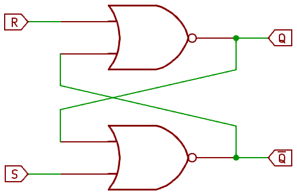
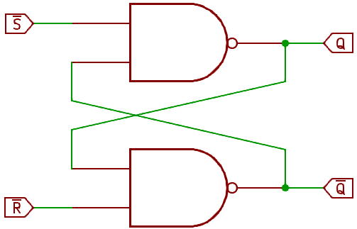
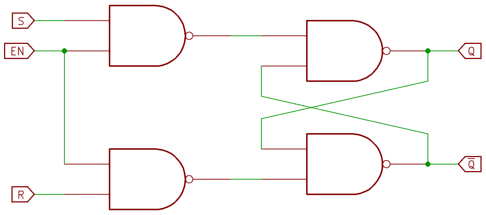
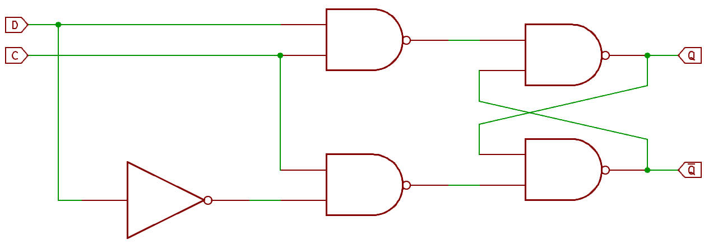
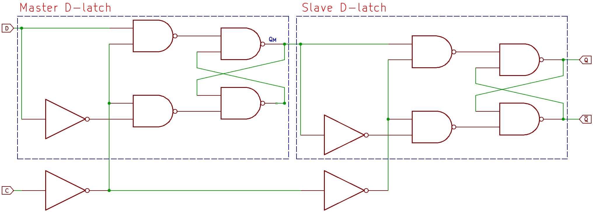
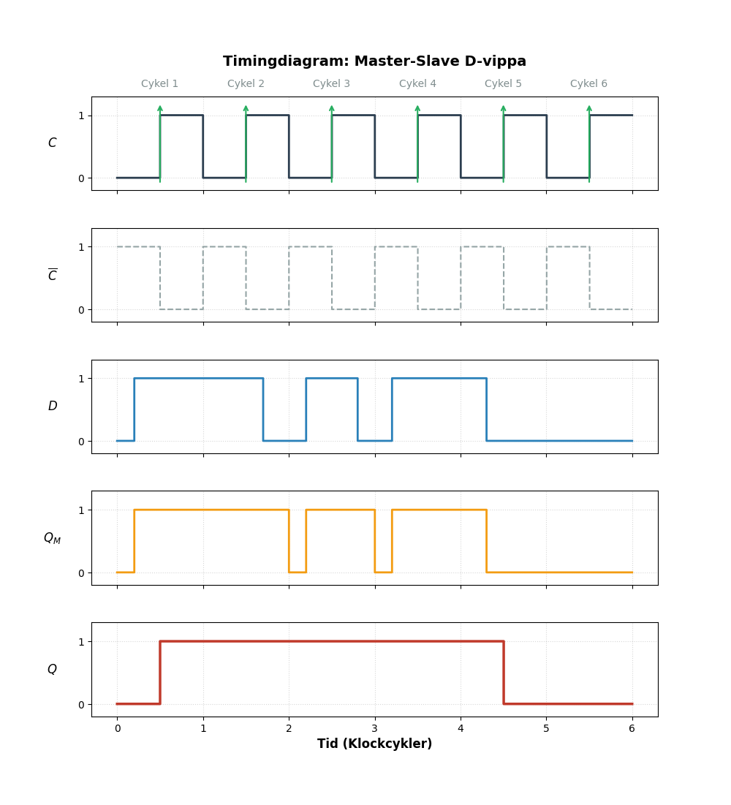
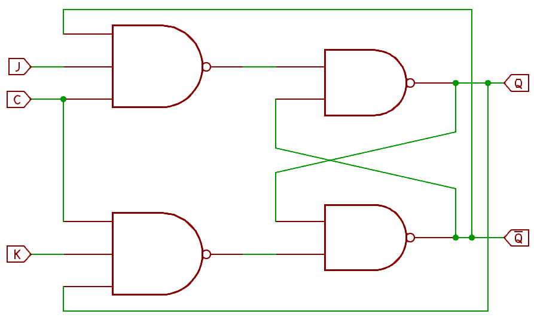

# Sekventiella kretsar – Logik med minne {#sec-sekventiella-kretsar}

Hittills har vi bara arbetat med **logiska grindar** och hur dessa kan byggas samman till **kombinatoriska kretsar**. I dessa bestäms utgångens värde *enbart* av de nuvarande insignalerna. Så fort du ändrar en ingång, ändras utgången (efter en kort grindfördröjning). Det finns ingen historia och inget minne.

**Sekventiella kretsar** fungerar annorlunda. Det är kretsar som har någon form av minne. Det betyder att utgångens värde är en konsekvens av både insignaler och kretsens tidigare historik. Man kan se det som att tidigare utsignal faktiskt fungerar som en insignal. Det är faktiskt precis så som man löser minnesfunktionaliteten i sekventiella kretsar. Genom att återkoppla en utgång till en ingång skapar vi kretsar som "minns" vad som hände nyss. Detta är grunden för digitalt lagringsutrymme, från enkla register till RAM-minnen.

* **Kombinatorik:** $Y = f(\text{Ingångar})$
* **Sekventiell logik:** $Y = f(\text{Ingångar, Tidigare tillstånd})$

<!-- ---------------------------------------------------------------------------------------------------- -->
## Latchar (Nivåstyrda minneselement) {#sec-latchar}

En **latch** är den enklaste formen av minne. Den kallas ofta för "genomskinlig" (transparent) eftersom den ändrar sitt tillstånd så fort ingångarna ändras, förutsatt att den är aktiverad.

### SR-latchen (Set-Reset)
Den mest grundläggande latchen är SR-latchen. Den har två ingångar:

1.  **S (Set):** Sätter utgången $Q$ till 1.
2.  **R (Reset):** Nollställer utgången $Q$ till 0.

Den har också oftast två utgångar: $Q$ och dess invers $\overline{Q}$. Värt att notera, latch kallas *nivåstyrd vippa* med ett svenskt uttryck. Men det finns stor risk för sammanblandning med det som heter vippa (engelska: flip-flop) som har en likartad men ändå lite annorlunda funktion. Detta kommer vi se senare i @vippor. För att undvika sammanblandning används här det engelska begreppet latch och inte det svenska nivåstyrd vippa. Men det kan vara bra att veta att det slarvas mycket med begreppen när det gäller dessa grundbyggblock inom sekventiell logik. Många kallar även latchar för vippor.

{#fig-SR-latch-with-NOR width=50%}

Kretsschemat i @fig-SR-latch-with-NOR visar hur man korsvis återkopplar NOR-grindarnas utgångarna till ingångarna. På så sätt skapas grunden för minnesfunktionen, och digitalteknikens enklaste latch (SR-latchen) är född. Sanningstabellen för denna krets visas i @tbl-SR-latch-NOR.

Table: Sanningstabell för NOR-baserad SR-latch. {#tbl-SR-latch-NOR}

| S | R | $Q$ | $\overline{Q}$ | Kommentar |
|:-:|:-:|:---:|:---:|:---|
| 0 | 0 | $Q_0$ | $\overline{Q_0}$ | **Minne:** Ingen ändring sker. |
| 0 | 1 | 0 | 1 | **Reset:** Utgången nollställs. |
| 1 | 0 | 1 | 0 | **Set:** Utgången sätts till ett. |
| 1 | 1 | 0* | 0* | **Förbjudet:** Båda utgångarna blir noll. |

::: {.callout-note}
## Praktiskt exempel: Status-låsning (Event Capture)
I inbyggda system kan vissa händelser vara extremt korta, till exempel en spänningsspik från en kritisk sensor eller en kortvarig varningssignal från en motorstyrenhet. Om processorn är upptagen med en annan tidskritisk uppgift (som att skicka data över ett nätverk) kan den missa att pinnen blinkade till.

Genom att använda en **SR-latch** kan vi "fånga" händelsen:

1.  **Set:** Den korta fel-signalen kopplas till $S$-ingången. Så fort felet uppstår sätts latchen och utgången $Q$ går hög – och **stannar där**.
2.  **Poll:** Processorn kan nu i lugn och ro läsa av pinnen när den har tid och se att "något har hänt" (att $Q=1$).
3.  **Reset:** När processorn har registrerat felet skickar den en kort puls från en GPIO-pinne till latchens $R$-ingång för att nollställa den och göra den redo för nästa händelse.

Detta fungerar som ett enkelt hårdvaruminne som avlastar mjukvaran från att behöva övervaka och läsa av pinnen hela tiden (så kallad polling). Detta är då ett alternativ till att arbeta med interrupt.
:::

Som @tbl-SR-latch-NOR indikerar är tillståndet $S=1, R=1$ problematiskt. Om båda ingångarna går höga ($1$) så kommer båda utgångarna bli låga ($0$). Det blir motsägelsefullt eftersom utgången $\overline{Q}$ är definierad som inversen av $Q$. Men det stora problemet uppkommer om båda ingångarna sedan slår om till låg signal samtidigt för att gå till minnestillståndet, efter att ha varit höga. Då kan kretsen hamna i ett läge där den "tävlar" om vilket värde den ska ha på utgångarna.

1.  Start med $S=1, R=1$: Båda utgångarna är $0$.
2.  Förändring: Vi tar bort båda ettorna på ingångarna samtidigt och sätter dessa till nollor.
3.  Kapplöpningen (race condition): Båda NOR-grindarna ser nu nollor på båda sina ingångar och "tävlar" om att bli först med att skicka ut en etta.
4.  Den som vinner skickar ut en etta som kommer in på den andra NOR-grindens ingång. Denna grind kommer då lägga ut en nolla enligt sanningstabellen i @tbl-SR-latch-NOR .
4.  Resultatet: Den grind som är bråkdelen av en nanosekund snabbare vinner.

Men om de är "exakt" lika snabba? Då hamnar vi under en tid i det som kallas i **metastabilitet**. Kretsen står och väger och har spänningsnivåer som ligger någonstans mellan låg respektive hög spänning. Transitorerna, som bygger upp de logiska grindarna, är vare sig stängda (av) eller öppna (på) utan är halvöppna.

SR-latchen kan även byggas med två NAND-grindar, se @fig-SR-latch-with-NAND och @tbl-SR-latch-NAND. Den stora skillnaden blir att latchen nu styrs med signaler som är aktivt låga istället. Det betecknas med $\overline{S}$ och $\overline{R}.$

{#fig-SR-latch-with-NAND width=50%}

Table: Sanningstabell för NAND-baserad SR-latch. {#tbl-SR-latch-NAND}

| $\bar{S}$ | $\bar{R}$ | $Q$ | $\overline{Q}$ | Kommentar |
|:---:|:---:|:---:|:---:|:---|
| 1 | 1 | $Q_0$ | $\overline{Q_0}$ | **Minne:** Ingen ändring sker. |
| 0 | 1 | 1 | 0 | **Set:** Utgången sätts till 1. |
| 1 | 0 | 0 | 1 | **Reset:** Utgången nollställs. |
| 0 | 0 | 1* | 1* | **Förbjudet:** Båda utgångarna tvingas höga. |

::: {.callout-note}
## Praktiskt exempel: Avstudsning av knappar (Debouncing)
Mekaniska strömbrytare är "smutsiga" i digital mening. När du trycker på en knapp uppstår små gnistor och mekaniska vibrationer som gör att signalen hoppar mellan 0 och 1 flera gånger under några millisekunder. För en snabb processor ser detta ut som flera snabba knapptryckningar.

Genom att använda en **SR-latch** (ofta en NAND-baserad $\overline{S}\overline{R}$-latch) och en växelkontakt (SPDT, Single Pole Dual Throw) kan vi skapa en perfekt digital signal. Latchen ändrar tillstånd ($\overline{S}$ aktiveras) vid den allra första kontakten och ignorerar sedan alla vibrationer ("studsar"). Varje studs kommer få latchen att växla mellan minnesläget och ytterligare aktivering av $\overline{S}$, vilket inte påverkar utsignalen. Latchen håller kvar detta tillstånd fram tills kontakten fysiskt flyttas till det andra läget, som då är kopplad till $\overline{R}$. Detta sparar värdefull processorkraft då man slipper hantera filtrering i mjukvara.
:::

I kretsschema så ritas SR-latchen med en förenklad symbol, dvs. den ritas inte med alla ingående logiska grindar. @fig-SR-IEC-symbol visar IEC-symbolen för SR-latchen.

{#fig-SR-IEC-symbol width=15%}

### D-latchen (Data latch)
Som vi sett så har SR-vippan en del egenskaper som kan ge problem. Dels har den förbjudet tillstånd och som en föjd av detta finns det risk för kapplöpning och metastabilitet. Dessutom så kommer utgången $Q$ hela tiden följa det som händer med Set $S$ och Reset $R$. Om SR-vippan ligger i sin minnesfas med $S = 1$, så kan en kort, oönskad störning och spänningsförändring på $R$ göra så att SR-vippan nollställs.

Det senare problemet kan hanteras genom att lägga till en **Enable**. Detta kan implementeras genom att lägga till två NAND-grindar till den enkla SR-latchen implementerad med NAND, se @fig-SR-latch-with-Enable De extra NAND-grindarna kan öppna och stänga SR-latchens funktion.  

{#fig-SR-latch-with-Enable width=50%}

Fast det löser inte problemet med det förbjudna tillståndet! Men med ytterligare en modifiering av SR-latchen (en inverterare läggs till) så fås det som heter D-latch (D står för Data). Ingången $D$ ersätter $S$ och $R$  enligt @fig-D-latch. Enable $EN$ kallas ofta för $C$ för en D-latch, där $C$ står för Control eller Clock. För att undvika det förbjudna tillståndet i SR-latchen och kontrollera *när* data ska sparas använder vi en **D-latch**. Den har en dataingång ($D$) och en aktiveringssignal $C$.

{#fig-D-latch width=50%}

Inverteraren gör att problemet med det förbjudna tillståndet elimineras. Ingångarna till latchen kan inte längre ha samma värde, eftersom de är inversen av varandra. Sanningstabellen blir också enklare, se @tbl-D-latch.

Table: Sanningstabell för D-latch. {#tbl-D-latch}

| C | D | $Q_{n+1}$ | Kommentar |
|:-:|:-:|:---:|:---|
| 0 | X | $Q_0$ | Låst (Behåller tidigare värde) |
| 1 | 0 | 0 | Genomskinlig (Reset) |
| 1 | 1 | 1 | Genomskinlig (Set) |

::: {.callout-note}
## Praktiskt exempel: Adress-latchning (spara pinnar vid parallellkommunikation)
I mindre inbyggda system eller vid kommunikation med externa minnen vill man ofta hålla nere antalet anslutningspinnar på processorn för att spara plats och kostnad. Ett sätt att göra detta är att använda gemensamma samma pinnar för både **adress** (var data ska hämtas) och **data** (vad som ska hämtas). Detta kallas Adress/Data-multiplexering.

Här spelar en D-latch (t.ex. den klassiska kretsen 74HC373) en avgörande roll. Denna krets en en 20-pinnars krets med åtta D-latchar, $LE$ (latch enable, kopplad till latchens C-ingång) på ingångssidan och $\overline{OE}$ (output eneble) på utgångssidan.

1.  **Adressfas:** Processorn lägger ut adressen på de gemensamma pinnarna och sätter kontrollsignalen $LE$ (i detta sammanhang ofta kallad *Address Latch Enable*, ALE) hög. D-latchen blir då "genomskinlig" och släpper igenom adressen till minneskretsen.
2.  **Låsning:** Processorn sätter $C$ låg ($0$). Nu är adressen "fryst" på latchens utgångar och hålls kvar stabilt mot minnet. Latchens utgångar är kopplade till adressbussen, där övriga enheter kan läsa vilken adress processorn ska arbeta med.
3.  **Datafas:** Processorn kan nu slå om sina egna pinnar och använda dem för att läsa in själva datan från minnet (eller skriva), utan att adressen försvinner.

Utan D-latchen skulle adressen försvinna så fort processorn slutade driva den, och minnet skulle inte veta varifrån det ska hämta informationen.
:::

### Varför räcker inte latchar?

D-latchen är fortfarande en transparent latch. När $C = 1$ är latchen öppen och $Q = D$, det vill säga data "slinker igenom" latchen. Så om $D$ ändras under den tid som $C$ är hög kommer även $Q$ att ändras. Det kan vara en oönskad egenskap i vissa system, där man önskar arbeta synkront med många latchar på ett sådant sätt att utgångsvärdena sätts vid en distinkt tidpunkt. I komplexa processorer och synkrona system vill vi att alla delar ska uppdateras exakt samtidigt, som på ett givet kommando, och inte tillåts variera då kontrollsignalen är aktiv. Man önskar en digital krets som reagerar på en **klockflank**. Det är här klocksignalen och **Flip-flops** (vippor) kommer in i bilden. De reagerar bara och låser data på en snabb förändring istället och kräver inte en stabil nivå under en längre tid.

<!-- ---------------------------------------------------------------------------------------------------- -->

## Vippor (Flip-Flops) {#sec-vippor}

Som avsnittet om latchar visade kan det finnas ett inneboende problem med att de är "transparenta". Så länge kontrollsignalen ($C$) är aktiv, kan data flöda fritt genom kretsen. I komplexa system där tusentals bitar ska flyttas samtidigt i takt med en klocka, skapar detta osäkerhet och risk för logiska fel.

Lösningen är vippan (flip-flop). Till skillnad från latchen, som reagerar på en nivå (hög eller låg signal), reagerar vippan endast på en förändring – en så kallad flank. Detta kallas för flanktriggning och är fundamentet för all modern processorarkitektur. Det är detta som gör att vi kan tala om en processors "klockfrekvens"; det är takten på dessa flanker som bestämmer när hela systemet tar nästa steg i sina beräkningar.

### Triggningsmetoder: Positiv och negativ flanktriggning

En klocksignal är i grunden en fyrkantsvåg som växlar mellan logisk 0 och 1. En vippa är konstruerad för att "sampla" (läsa av) sin ingång exakt i det ögonblick då klocksignalen byter tillstånd. Det finns två huvudsakliga sätt att trigga en vippa:

Positiv flanktriggning (Stigande flank):
Vippan reagerar exakt när klocksignalen går från 0 till 1. Detta är den absolut vanligaste metoden i modern digitalteknik. I kretsscheman ritas detta med en liten triangel vid klocksingången.

Negativ flanktriggning (Fallande flank):
Vippan reagerar istället när klocksignalen går från 1 till 0. I kretsscheman markeras detta med en liten ring (invertering) framför triangeln vid klocksingången.

::: {.callout-tip}

Varför är flanken så viktig?
Tänk på en vippa som en kamera. En latch fungerar som en videokamera som spelar in allt så länge knappen är intryckt. En vippa fungerar däremot som en stillbildskamera: den tar ett "foto" av ingången exakt vid flanken. Vad som händer med ingången precis före eller precis efter flanken spelar ingen roll – det är bara bilden som togs i klockögonblicket som sparas i minnet.
:::

Detta korta ögonblick av sampling gör att vi kan koppla samman miljontals vippor i långa kedjor. Eftersom de bara ändrar sig vid flanken, riskerar vi inte att data "rinner igenom" flera steg under en och samma klockcykel, vilket är en förutsättning för att kunna bygga fungerande datorer.

### D-vippan (Edge-triggered D Flip-Flop)

D-vippan är den absolut viktigaste byggstenen i modern digitalteknik. Nästan alla register i en processor, från enkla statusflaggor till breda databussar, består av rader med D-vippor. 

Namnet "D" står för **Data** (eller ibland *Delay*), och precis som för D-latchen är funktionen enkel: utgången $Q$ ska kopiera värdet på ingången $D$. Skillnaden ligger i *när* detta sker. Medan latchen är öppen så länge kontrollsignalen är hög, läser vippan av $D$ endast vid en **klockflank**.

För att skapa denna "ögonblicksbild" (sampling) internt, kopplar man oftast samman två D-latchar i serie. Denna konstruktion kallas för en **Master-Slave**-konfiguration, se @fig-D-flipflop-logic.

1.  **Master-latchen** är öppen när klockan är låg (på grund av den första inverteringen av $C$). Den följer ingången $D$ men kan inte nå utgången $Q$ på vippan än.
2.  **Slave-latchen** är låst när klockan är låg, vilket gör att utgången $Q$ behåller sitt gamla värde.
3.  **Vid flanken (0 till 1):** Master-latchen låser sig (fryser värdet på $D$), samtidigt som Slave-latchen öppnas och skickar ut det frysta värdet till $Q$.

Resultatet blir att utgången endast kan ändras exakt vid den stigande flanken.

{#fig-D-flipflop-logic width=70%}

I sanningstabellen för en vippa använder vi en pil ($\uparrow$) för att markera den stigande klockflanken. Detta skiljer den tydligt från latcharnas tabeller där vi använde logiska nivåer (0 eller 1).

Table: Sanningstabell för positivt flanktriggad D-vippa. {#tbl-D-flipflop}

| C | D | $Q$ | $\overline{Q}$ | Kommentar |
|:---:|:---:|:---:|:---:|:---|
| 0, 1, $\downarrow$ | X | $Q_0$ | $\overline{Q_0}$ | **Vila:** Ingen ändring sker utom vid stigande flank. |
| $\uparrow$ | 0 | 0 | 1 | **Sampling:** En nolla sparas på flanken. |
| $\uparrow$ | 1 | 1 | 0 | **Sampling:** En etta sparas på flanken. |

Sanningstabellen visar inte fullt ut hur funktionen i en D-vippa skiljer sig från funktionen i en D-latch. Då är timingdiagrammet ett bättre verktyg. I @fig-timing-dff ser vi hur en vippa reagerar på insignaler. Till skillnad från D-latchen, som är "genomskinlig", påverkas inte vippans utgång av vad som händer med $D$ mellan klockflankerna. Det är endast värdet precis vid pilen ($\uparrow$) som spelar roll. Men i signalen $Q_M$ som ligger mellan Master-latchen och Slave-latchen syns att första halvan av D-vippan är transparent.

{#fig-timing-dff width=70%}

::: {.callout-important}
## Setup och Hold time
Eftersom en vippa samplar data precis vid en flank, finns det fysiska krav på insignalen $D$ för att undvika fel:
* **Setup time ($t_s$):** Data måste ha varit stabil en kort stund *innan* flanken kommer.
* **Hold time ($t_h$):** Data måste ligga kvar en kort stund *efter* att flanken passerat.

Om dessa tider inte respekteras (till exempel om $D$ ändras precis samtidigt som klockan slår) riskerar vippan att hamna i **metastabilitet**, där utgången under en tid hamnar i ett obestämt läge mellan 0 och 1.
:::

### JK-vippan - den universella vippan

### JK-vippan – den universella vippan

JK-vippan kan ses som en vidareutveckling av den enkla SR-latchen, men med två avgörande skillnader: den är **flanktriggad** och den har inget "förbjudet" tillstånd. Namnet kommer enligt legenden från Jack Kilby, uppfinnaren av den integrerade kretsen.

Ingångarna $J$ (Jump/Set) och $K$ (Kill/Reset) fungerar analogt med Set och Reset, men med en unik twist när båda är höga samtidigt.

#### Sanningstabell
Det som gör JK-vippan unik är raden där både $J$ och $K$ är 1. Istället för att hamna i ett ogiltigt läge, kommer vippan att **toggla** (växla tillstånd). Om utgången var 0 blir den 1, och vice versa.

Table: Sanningstabell för positivt flanktriggad JK-vippa. {#tbl-JK-flipflop}

| C | J | K | $Q$ | Kommentar |
|:---:|:---:|:---:|:---:|:---|
| $\uparrow$ | 0 | 0 | $Q_0$ | **Minne:** Ingen ändring sker. |
| $\uparrow$ | 0 | 1 | 0 | **Reset:** Utgången nollställs. |
| $\uparrow$ | 1 | 0 | 1 | **Set:** Utgången sätts till ett. |
| $\uparrow$ | 1 | 1 | $\overline{Q_0}$ | **Toggle:** Utgången byter tillstånd (0→1 eller 1→0). |

#### Varför är JK-vippan "universell"?
Anledningen till att JK-vippan ofta kallas universell är att den enkelt kan konfigureras för att utföra andra vippors jobb:
* **Som en D-vippa:** Koppla en inverterare mellan $J$ och $K$ och använd $J$ som dataingång.
* **Som en T-vippa:** Koppla ihop $J$ och $K$ till en gemensam ingång.

#### Intern logik och återkoppling
JK-vippan löser SR-latchens problem med det förbjudna tillståndet genom att internt återkoppla utgångarna till ingångsgrindarna. Om utgången $Q$ redan är 1, kommer "Set"-ingången ($J$) att spärras logiskt, vilket gör att endast en "Reset"-operation (eller en toggle) är möjlig.

{#fig-JK-logic

### T-vippan - toogle-vippan för räknare
### T-vippan – toggle-vippan för räknare

T-vippan (där T står för **Toggle**) har bara en enda dataingång. Dess enda uppgift är att hålla reda på om den ska behålla sitt nuvarande värde eller "slå om" (invertera) vid nästa klockflank.

Detta gör den till hjärtat i nästan alla digitala räknare och klockfrekvensdelare.

#### Funktion och Sanningstabell
Logiken är extremt rak:
* Om $T=0$, händer ingenting vid klockflanken (**Minne**).
* Om $T=1$, byter utgången tillstånd vid klockflanken (**Toggle**).

Table: Sanningstabell för positivt flanktriggad T-vippa. {#tbl-T-flipflop}

| C | T | $Q$ | Kommentar |
|:---:|:---:|:---:|:---|
| $\uparrow$ | 0 | $Q_0$ | **Minne:** Utgången förblir oförändrad. |
| $\uparrow$ | 1 | $\overline{Q_0}$ | **Toggle:** Utgången inverteras (0→1 eller 1→0). |

#### T-vippan som frekvensdelare
En av de vanligaste applikationerna för en T-vippa är att dela en klockfrekvens med två. Om man kopplar $T$ permanent till logisk etta ($1$), kommer utgången $Q$ att växla vid varje klockflank. 

Det innebär att $Q$ går hög vid första flanken, låg vid andra, hög vid tredje, och så vidare. Resultatet blir en ny fyrkantsvåg på utgången som har exakt **hälften** så hög frekvens som den ursprungliga klocksignalen. Genom att kedjekoppla flera T-vippor kan man enkelt dela ner en hög klockfrekvens till lägre hastigheter eller bygga binära räknare.

{#fig-T-timing width=80%}

#### Implementering
I praktiken köper man sällan en ren "T-vippa" som en enskild krets. Istället skapar man den genom att använda en **JK-vippa** där man kopplar samman $J$ och $K$ till en gemensam $T$-ingång, eller en **D-vippa** där man återkopplar den inverterade utgången $\overline{Q}$ till $D$-ingången.

::: {.callout-tip}
## Kom ihåg regeln
Tänk på T-vippan som en strömbrytare med en tryckknapp:
* $T=0$: Du trycker inte på knappen (lampan förblir som den är).
* $T=1$: Du trycker på knappen vid varje klockslag (lampan tänds/släcks varje gång).
:::

### Asynkrona ingångar för vippor (Preset och Clear)

### Asynkrona ingångar för vippor (Preset och Clear)

Hittills har vi bara tittat på **synkrona** ingångar ($D, J, K, T$), vilket innebär att vippan endast bryr sig om dem exakt vid klockflanken. Men i verkliga system behöver vi ibland kunna styra vippan omedelbart, oavsett vad klockan gör. 

För detta använder vi **asynkrona ingångar**, oftast kallade **Preset** (Sätt till 1) och **Clear** (Nollställ). Dessa ingångar har "högsta prioritet" och kör över allt annat.

#### Preset ($PRE$) och Clear ($CLR$)
* **Preset:** Tvingar utgången $Q$ till 1 omedelbart.
* **Clear:** Tvingar utgången $Q$ till 0 omedelbart.

I de flesta kommersiella kretsar (som t.ex. 74HC74) är dessa ingångar **aktivt låga**. Det betyder att de måste dras till 0 för att aktiveras, vilket i kretsscheman ritas med en liten ring vid ingången och betecknas med ett streck över namnet ($\overline{PRE}$ och $\overline{CLR}$).

#### Varför behövs asynkrona ingångar?
Den vanligaste användningen är vid **systemstart**. När strömmen slås på i en dator eller mikrokontroller kan vipporna hamna i ett slumpmässigt tillstånd (0 eller 1). Genom att skicka en kort asynkron "Clear"-puls till alla vippor i hela systemet garanterar man att maskinen startar från ett definierat nollställt läge.

#### Skillnaden mellan synkron och asynkron nollställning
Det är viktigt att förstå skillnaden i ett timingdiagram:
1.  **Synkron Reset:** Vippan nollställs endast om Reset-signalen är aktiv *samtidigt* som en klockflank sker.
2.  **Asynkron Reset:** Vippan nollställs *i samma ögonblick* som Reset-signalen blir aktiv, helt oberoende av klockan.

::: {.callout-warning}
## Prioritetsfällan
Om både Preset och Clear aktiveras samtidigt hamnar vippan i ett instabilt eller odefinierat läge (likt det förbjudna tillståndet i en SR-latch). I normal drift måste man se till att båda dessa ingångar är inaktiva (oftast hållna höga till logisk 1) för att vippan ska lyda klockan och dataingångarna.
:::